# ORIGINS COCOA — MASTER PRODUCTION & CONTENT BIBLE

**Document ID:** OC-BIBLE-001  
**Version:** 2.0  
**Status:** Production-Ready Draft  
**Last Updated:** July 31, 2026  
**Owner:** Origins Cocoa Brand & Creative Team  
**Classification:** Internal — Agency, Production, Development Handoff

---

> **Purpose of this document**  
> This is the single source of truth for Origins Cocoa's brand film, website content, visual language, and launch. It combines agency creative brief, director's treatment, information architecture specification, copy deck, and production handbook. **All creative, development, and production decisions must trace back to a section in this bible.**

---
---

## 00. Document Index & How to Use This Guide

### 00.1 Table of Contents

| # | Section | Primary Audience |
|---|---------|------------------|
| 00 | Document Index & How to Use | Everyone |
| 01 | Brand Foundation | Strategy, Copy, Leadership |
| 02 | Narrative Architecture (The Story Spine) | Director, Copywriter, UX |
| 03 | Site Structure & Information Architecture | **Developer, UX, Copywriter** |
| 04 | Brand Film — Full Director's Treatment | Director, DP, Editor, Sound |
| 05 | Page-by-Page Content Specifications | Copywriter, Developer |
| 06 | Voice, Tone & Copy Rules | Copywriter, Social |
| 07 | Visual & Motion Language | Design, Dev, Post |
| 08 | Production Pipeline (Step-by-Step) | Producer, Director |
| 09 | Asset Matrix & Deliverables Registry | Producer, Dev, Post |
| 10 | Competitive Reference Deep-Dive | Strategy, Creative |
| 11 | Launch Sequence & QA Checklist | Producer, Dev, Marketing |
| — | Appendices | All |

### 00.2 Who Reads What

| Role | Read First | Read Deep | Reference During | Keep Open |
|------|------------|-----------|------------------|-----------|
| Director / DP | §02 Story Spine | §04 Film Treatment | §08 Shoot Schedule | Appendix B Shot List |
| Copywriter | §01 Brand Foundation | §05 Page Copy | §06 Voice Rules | Appendix A VO Script |
| Developer | **§03 Site IA** | §05 Component mapping | §07 Design Tokens | §09 Asset filenames |
| Producer | §08 Pipeline | §09 Asset Matrix | §11 Launch Checklist | §08 Risk Register |
| Editor / Sound | §04 Scenes | §07 Video treatment | §09 Deliverables | Appendix A VO |
| Marketing / PR | §01 Positioning | §10 Competitive | §11 Marketing | §05 Microcopy |

### 00.3 How to Use This Document

1. **Before writing copy** → Read §01 and §06.
2. **Before touching code** → Read §03 in full. Map every section to `src/components/`.
3. **Before filming** → Read §04 and cross-reference §09 for filenames.
4. **Before launch** → Complete every checkbox in §11.

### 00.4 Document Conventions

| Symbol | Meaning |
|--------|---------|
| `[COMPONENT]` | Maps to React component in codebase |
| `→` | User flow or narrative transition |
| **BOLD** | Approved final copy |
| `ALL CAPS` | Trust tags, labels, on-screen film text |
| `(decision needed: …)` | Requires stakeholder sign-off |

### 00.5 Version History

| Version | Date | Changes | Author | Status |
|---------|------|---------|--------|--------|
| 2.0 | 2026-07-31 | Full rewrite — production bible architecture | Creative Lead | **Current** |
| 1.0 | 2026-07-31 | Initial making script guide (648 lines) | Creative Lead | Superseded |

### 00.6 Codebase Component Registry

| Component | Route(s) | Bible Ref | Status |
|-----------|----------|-----------|--------|
| `Navigation.tsx` | Global | §03.0 | Implemented |
| `Footer.tsx` | Global | §03.0, §05 | Implemented |
| `Hero.tsx` | `/` | §03.1, §05.1 | Implemented — film modal pending |
| `HomeTeasers.tsx` | `/` | §03.1, §05.1 | Implemented |
| `OriginStory.tsx` | `/our-craft` | §03.2 S1 | Implemented |
| `RegionSection` (in OriginStory) | `/our-craft` | §03.2 S2 | Implemented |
| `Fermentery.tsx` | `/our-craft` | §03.2 S3 | Media placeholder |
| `Traceability.tsx` | `/our-craft` | §03.2 S4 | Media placeholder |
| `Products.tsx` | `/products` | §03.4 | Media placeholders |
| `FarmerCommunity.tsx` | `/community` | §03.3 S1 | Portrait placeholders |
| `AudienceSplit.tsx` | `/community` | §03.3 S2 | Implemented |
| `Connect.tsx` | `/connect` | §03.5 | Implemented — form backend pending |
| `FadeIn.tsx` | All sections | §07.5 | Implemented |
| `MediaPlaceholder.tsx` | Multiple | §09 | Replace at launch |
---

## 01. Brand Foundation

### 01.1 Mission

**Mission statement:**  
To unlock the fine-flavour potential of Indian cacao by owning post-harvest science, partnering equitably with farmer-members, and delivering traceable beans that empower craft chocolate makers worldwide.

### 01.2 Vision

**Vision statement (10-year):**  
West Godavari becomes a recognised fine-flavour origin on the global cacao map — named alongside Ecuador, Madagascar, and Venezuela — with Origins Cocoa as the trusted bridge between Indian farms and the world's best makers.

### 01.3 Positioning Statement

**For** professional craft chocolate makers and passionate creators **who** need consistent, traceable, flavour-forward cacao beans, **Origins Cocoa** is the **West Godavari origin partner** that **combines farmer-direct relationships, scientific fermentation, and end-to-end traceability** — unlike commodity brokers or consumer chocolate brands that obscure the source.

### 01.4 Target Audiences

#### 01.4.1 Primary — Craft Chocolate Makers (B2B)

| Attribute | Detail |
|-----------|--------|
| **Who** | Bean-to-bar chocolatiers, pastry chefs, confectioners, R&D teams at premium brands |
| **Geography** | India (primary), Southeast Asia, Europe, North America (export growth) |
| **Motivation** | Unique origin story, flavour differentiation, supply consistency, technical specs |
| **Pain points** | Inconsistent Indian cacao quality, opaque supply chains, lack of fermentation control |
| **Decision drivers** | Sample quality, COA/spec sheets, traceability data, fermentation customisation |
| **Site behaviour** | Products → Our Craft → Connect (sample request) |

#### 01.4.2 Secondary — Passionate Creators

| Attribute | Detail |
|-----------|--------|
| **Who** | Home makers, culinary students, food entrepreneurs exploring craft chocolate |
| **Motivation** | Learning, experimentation, access to premium ingredients |
| **Pain points** | Intimidation of sourcing, unclear where to start with Indian cacao |
| **Site behaviour** | Home → Community → Connect |

#### 01.4.3 Tertiary — Press, Partners, Investors

| Attribute | Detail |
|-----------|--------|
| **Who** | Food media, sustainability journalists, NGO partners, agri-tech investors |
| **Motivation** | Story, impact data, innovation in Indian agriculture |
| **Site behaviour** | Film → Our Craft → Community |

### 01.5 Brand Pillars (with Proof Points)

#### Pillar 1 — Origin Integrity

- West Godavari: India's largest cacao region, relatively unknown as fine-flavour origin
- Single origin, single farm, and micro-lot product architecture
- Terroir expression through intercropping (banana, areca, long pepper)
- **Proof:** Region map animation (film Scene 3), `RegionSection` copy

#### Pillar 2 — Scientific Fermentation

- State-of-the-art fermentery at Talikadapudi
- Proprietary technology for temperature, pH, and turn monitoring
- Named protocols: Long Pepper Infusion, Banana Leaf Protocol, Areca Nut Shade Dried
- **Proof:** Fermentery section, film Scene 5, processing data shared with makers

#### Pillar 3 — Farmer Equity

- 100+ carefully selected farmer-members
- Premium payment within 24 hours via transparent digital platform
- Quality-based selection, not volume aggregation
- **Proof:** Community page portraits, film Scene 4, blockchain purchase records

#### Pillar 4 — End-to-End Traceability

- Blockchain-enabled platform recording farm → harvest → ferment → ship
- Lot-level data accessible to chocolate makers
- **Proof:** Traceability section, film Scene 6, `Traceability.tsx`

#### Pillar 5 — Maker Partnership

- Custom fermentation lots co-designed with chocolatiers
- Technical specs on request (moisture %, bean count, pH range)
- Sample programme for qualified makers
- **Proof:** Products tabs (Custom Fermentation), Connect CTA, AudienceSplit

### 01.6 Messaging Hierarchy

| Level | Copy | Use |
|-------|------|-----|
| **One-liner** | Fine-flavoured Indian cacao, from West Godavari to makers worldwide. | Email sig, social bio |
| **Elevator pitch (30 sec)** | Origins Cocoa partners with 100+ West Godavari farmer-members to grow, ferment, and ship traceable cacao beans for craft chocolate makers. Our Talikadapudi fermentery brings scientific post-harvest control to an origin the world has yet to truly taste. | Events, investor intros |
| **Manifesto paragraph** | Introduced in the 1960s as an industrial ingredient, Indian cacao's flavour was traded for productivity. For sixty years, its potential lay dormant. Origins Cocoa exists to change that — returning attention to terroir, honouring the hands that harvest, and applying science where it matters most: fermentation. From the banks of the Godavari to your atelier, every bean is intentional. | Film VO, About sections, press kit |
| **Tagline pair** | In pursuit of / A fine-flavoured Indian Cacao Bean | Hero headline |

### 01.7 What Origins Cocoa Is NOT

| We are NOT | We ARE | Why it matters |
|------------|--------|----------------|
| A consumer chocolate brand | A cacao origin & fermentery partner | Avoid Manam-style D2C confusion |
| A commodity broker | A relationship-driven origin house | Emphasise traceability + quality selection |
| A generic "luxury" food brand | A specific West Godavari story | Origin specificity is the differentiator |
| A sustainability-washing operation | Transparent, data-backed equity | Proof over platitudes |
| A copy of Distinct Origins | Inspired by, not derivative of | Own voice, own protocols, own maker focus |
| An e-commerce-first website | Story-first, conversion via Connect | Homepage has no cart |
---

## 02. Narrative Architecture (The Story Spine)

### 02.1 Master Story Spine

```mermaid
flowchart LR
    A[ACT I — PROBLEM] --> B[ACT II — PROCESS]
    B --> C[ACT III — PROMISE]

    subgraph ACT1["Act I: The Forgotten Flavour"]
        A1[Hook: Pursuit of flavour]
        A2[History: 1960s industrial cacao]
        A3[Stakes: 60 years dormant potential]
    end

    subgraph ACT2["Act II: The Work"]
        B1[Land: West Godavari terroir]
        B2[People: 100+ farmer-members]
        B3[Science: Talikadapudi fermentery]
        B4[Proof: Traceability platform]
    end

    subgraph ACT3["Act III: The Invitation"]
        C1[Product: Beans for makers]
        C2[Brand: Origins Cocoa lockup]
        C3[CTA: Begin your origin story]
    end

    A --> A1 --> A2 --> A3 --> B
    B --> B1 --> B2 --> B3 --> B4 --> C
    C --> C1 --> C2 --> C3
```



### 02.2 Three-Act Summary

| Act | Theme | Duration (film) | Website equivalent |
|-----|-------|---------------|-------------------|
| **I — Problem** | Indian cacao's flavour was sacrificed for productivity | 0:00–0:35 | Hero + Origin Story (`OriginStory.tsx`) |
| **II — Process** | Land, people, science, transparency rebuild trust | 0:35–2:00 | Region + Fermentery + Traceability + Community |
| **III — Promise** | Exceptional beans invite makers into the story | 2:00–2:30 | Products + Connect |

### 02.3 Beat Sheet (18 Beats)

| Beat # | Beat Name | Emotion | Film Scene | Website Location | Copy Anchor |
|--------|-----------|---------|------------|------------------|-------------|
| 1 | Opening wonder | Awe | 1 | Hero intro line | "In pursuit of…" |
| 2 | Scale of landscape | Wonder | 1 | Hero image | — |
| 3 | Historical context | Contemplation | 2 | Origin Story p1 | "Introduced in the 1960s…" |
| 4 | Cost of industrialisation | Tension | 2 | Origin Story p1 | "productivity became the sole focus" |
| 5 | Shift of focus | Hope | 2–3 | Origin Story p2 | "we are shifting the focus back" |
| 6 | Terroir reveal | Discovery | 3 | Region Section | "West Godavari…" |
| 7 | Intercropping nuance | Curiosity | 3 | Region Section p2 | banana, areca, long pepper |
| 8 | Unknown origin | Intrigue | 3 | Region Section p2 | "relatively unknown" |
| 9 | Community scale | Warmth | 4 | Farmer Community | "100+ farmer-members" |
| 10 | Fair payment | Trust | 4 | Farmer Community p2 | "premium within 24 hours" |
| 11 | Post-harvest ownership | Confidence | 5 | Fermentery | "take full ownership" |
| 12 | Scientific protocols | Authority | 5 | Fermentery step 2 | "science-based interventions" |
| 13 | Data for makers | Credibility | 5–6 | Traceability | "digitally recorded" |
| 14 | Blockchain transparency | Trust | 6 | Traceability | "blockchain-enabled platform" |
| 15 | Product reveal | Desire | 7 | Products | "Single origin…" |
| 16 | Maker invitation | Aspiration | 7–8 | Audience Split | "professional makers" |
| 17 | Brand resolution | Pride | 8 | Footer, Hero | "Origins Cocoa" |
| 18 | Call to action | Invitation | 8 → site | Connect | "Begin Your Origin Story" |

### 02.4 Emotional Arc Map

```
WONDER ──────► TENSION ──────► TRUST ──────► INVITATION
  │               │               │                │
  Hero          1960s           Fermentery       Products
  Dawn          history         Traceability     Connect
  Godavari      overlooked      Farmer pay       "Begin your
  mist                          data             origin story"
```

| Phase | Emotion | Intensity (1–10) | Visual register | Music register |
|-------|---------|------------------|-----------------|----------------|
| Wonder | Curiosity, awe | 7 | Golden hour, wide | Solo piano |
| Tension | Contemplation | 5 | Desaturated archival | Sparse, minor |
| Trust | Confidence, warmth | 8 | Rich browns, faces | Strings + tabla texture |
| Invitation | Openness, aspiration | 7 | Product macro, dusk | Resolve chord |

### 02.5 Film → Website Scroll Mapping

| Film Timestamp | Narrative Beat | Website Page | Section | Component |
|----------------|----------------|--------------|---------|-----------|
| 0:00–0:18 | Hook | `/` | Hero | `Hero.tsx` |
| 0:18–0:35 | Problem | `/our-craft` | Origin Story | `OriginStory.tsx` |
| 0:35–0:55 | Terroir | `/our-craft` | West Godavari | `RegionSection` |
| 0:55–1:15 | Community | `/community` | Farmer grid | `FarmerCommunity.tsx` |
| 1:15–1:45 | Fermentery | `/our-craft` | Fermentery | `Fermentery.tsx` |
| 1:45–2:00 | Traceability | `/our-craft` | Traceability | `Traceability.tsx` |
| 2:00–2:18 | Product | `/products` | Product tabs | `Products.tsx` |
| 2:18–2:30 | Invitation | `/connect` | Connect form | `Connect.tsx` |

### 02.6 Narrative Principles (Non-Negotiable)

1. **Problem before product** — Never lead with SKUs. Lead with why Indian cacao matters.
2. **People before process** — Farmer faces appear before fermentation boxes in scroll order on Community; film intercuts but never objectifies.
3. **Specificity over superlatives** — "Talikadapudi" not "world-class facility"; "24 hours" not "fast payment."
4. **Maker as hero** — Origins Cocoa enables; the chocolatier creates. Scene 7 shows maker hands, not brand packaging.
5. **Invitation, not hard sell** — CTAs are "Explore," "Connect," "Request Samples" — never "Buy Now" on homepage.
### 02.7 Beat-by-Beat Emotional Micro-Map

| Beat | Name | Emotion | Audio | Visual | Web copy anchor |
| --- | --- | --- | --- | --- | --- |
| 1 | Opening wonder | Curiosity | Low piano | Wide landscape | Hero intro line |
| 2 | Scale reveal | Awe | Piano continues | Drone push | Trust tags subconscious |
| 3 | Historical weight | Melancholy | Minor key | Archival stills | Origin p1 |
| 4 | Dormant potential | Tension | Pause in music | Purple beans | Origin p1 close |
| 5 | Agency shift | Hope | Major resolve | Farm walk | Origin p2 |
| 6 | Terroir specificity | Discovery | Strings enter | Map animation | Region p1 |
| 7 | Intercrop nuance | Intrigue | Light percussion | Long pepper | Region p2 |
| 8 | Unknown origin | Ambition | Build | Banana shade | Region p2 close |
| 9 | Community scale | Belonging | Warmth | Portrait 1 | Community H2 |
| 10 | Individual dignity | Respect | Intimate | Portraits 2-4 | Grid layout |
| 11 | Fair payment | Trust | Phone chime | Payment UI | Community p2 |
| 12 | Post-harvest shift | Confidence | Industrial tone | Fermentery ext | Fermentery intro |
| 13 | Scientific rigour | Authority | Pulse | Box turn | Fermentery H3 |
| 14 | Data culture | Credibility | Digital texture | Monitor UI | Fermentery H3 b |
| 15 | Transparency proof | Assurance | Clean mix | Blockchain UI | Traceability |
| 16 | Product desire | Anticipation | Swelling strings | Bean pour | Products tabs |
| 17 | Maker empowerment | Aspiration | Human scale | Maker hands | Audience split |
| 18 | Open invitation | Welcome | Final chord | Dusk + logo | Connect CTA |

### 02.8 Cross-Channel Narrative Consistency

| Channel | Act I hook | Act II proof | Act III CTA |
| --- | --- | --- | --- |
| Website | Hero headline | Our Craft scroll | Connect form |
| Brand film | Scene 1 VO | Scenes 3-6 | Scene 8 lockup |
| Instagram | 60s cutdown hook | Fermentery clip | Link in bio |
| Email | Subject: In pursuit of flavour | Bean specs body | Reply to wholesale@ |
| Press kit | Manifesto paragraph | Farmer quote + data | hello@ contact |
| Trade show | Loop Scene 5 | Spec sheet handout | QR to /connect |

---

## 03. Site Structure & Information Architecture

> **§03 is the structural centerpiece of this bible.** Every page, section, component, CTA, and scroll behaviour is specified here. Developers implement from this section. Copywriters pull final copy from §05 but must respect IA order defined here.

### 03.0 Global Architecture

#### 03.0.1 Site Map Tree

```
originscocoa.com/
├── /                          [Home]
│   ├── Hero                   → Hero.tsx
│   └── Discover Origins       → HomeTeasers.tsx
├── /our-craft                 [Our Craft]
│   ├── #origin                → OriginStory.tsx
│   ├── (Region)               → RegionSection
│   ├── #process               → Fermentery.tsx
│   └── #traceability          → Traceability.tsx
├── /community                 [Community]
│   ├── #community             → FarmerCommunity.tsx
│   └── Partners in Creation   → AudienceSplit.tsx
├── /products                  [Products]
│   └── #products              → Products.tsx
└── /connect                   [Connect]
    └── #connect               → Connect.tsx

Global (all routes):
├── Navigation.tsx             (fixed header)
└── Footer.tsx                 (site footer)
```

#### 03.0.2 Route Registry

| Route | Page Title (metadata) | Layout | Primary Goal | Entry Points |
|-------|----------------------|--------|--------------|--------------|
| `/` | Origins Cocoa — Fine-Flavoured Indian Cacao from West Godavari | `Hero` + `HomeTeasers` | Emotional hook + route to depth | Direct, social, PR |
| `/our-craft` | Our Craft — Origins Cocoa | 4 stacked sections | Build credibility in origin + process | Nav, teasers, footer |
| `/community` | Community — Origins Cocoa | 2 stacked sections | Humanise supply chain | Nav, home footer links |
| `/products` | Products — Origins Cocoa | Tabbed product grid | Showcase bean portfolio | Nav, CTAs throughout |
| `/connect` | Connect — Origins Cocoa | Form + contact block | Lead capture / inquiry | Nav, all page CTAs |

#### 03.0.3 Global Navigation (`Navigation.tsx`)

| Element | Spec |
|---------|------|
| Logo | "Origins Cocoa" — Ivy Presto Display, uppercase, 22px mobile / 26px desktop |
| Subline | "A West Godavari Initiative" — Space Grotesk, 8–9px, tracking 0.28em |
| Nav links (desktop lg+) | Products · Our Craft · Community · Connect |
| Nav order | Products first (maker intent), then story depth |
| Mobile | Hamburger → full-screen overlay menu |
| Scroll behaviour | Transparent → `bg-cream/95 backdrop-blur` after 60px scroll |
| Active state | Underline scale animation via `nav-menu-link-active` |

#### 03.0.4 Global Footer (`Footer.tsx`)

| Column | Content |
|--------|---------|
| Brand | Origins Cocoa + descriptor paragraph |
| Explore | Our Craft, Community, Products, Traceability (`/our-craft#traceability`) |
| Connect | Contact, Wholesale, Instagram |
| Bottom bar | © year + social links (Instagram, LinkedIn, YouTube) |

#### 03.0.5 Internal Linking Map (Master)

| From | To | Link Text | Type |
|------|-----|-----------|------|
| `/` Hero | Film modal | Play Film | Primary CTA (pending implementation) |
| `/` Hero | `/products` | Explore Our Beans → | Secondary (on scroll — pending) |
| `/` HomeTeasers | `/our-craft` | Explore → | Card CTA |
| `/` HomeTeasers | `/products` | Explore → | Card CTA |
| `/` HomeTeasers | `/community` | Meet Our Farmer Community | Text CTA |
| `/` HomeTeasers | `/connect` | Get in Touch | Text CTA |
| `/our-craft` Origin | `/products` | Explore Our Beans → | Inline CTA |
| `/our-craft` | `#traceability` | (footer only) | Anchor |
| `/community` | `/connect` | (implicit via Audience) | — |
| `/products` | `/connect` | Request Samples → (per card, pending) | Product CTA |
| All pages | `/connect` | Via nav | Persistent |
| Footer | All major routes | Explore column | Persistent |

#### 03.0.6 User Journey Flows

**Journey A — First-time Maker (B2B)**

```mermaid
flowchart TD
    A[Land on / from referral] --> B[Watch Play Film or scan Hero]
    B --> C{Interested in specs?}
    C -->|Yes| D[/products]
    C -->|Need trust first| E[/our-craft]
    E --> F[Read Fermentery + Traceability]
    F --> D
    D --> G[Review tab: Custom Fermentation]
    G --> H[/connect — Request Samples]
    H --> I[Sales follow-up within 48h]
```

**Journey B — Returning Buyer**

```mermaid
flowchart TD
    A[Direct to /products] --> B[Select tab + lot]
    B --> C[/connect]
    C --> D[wholesale@ email or form]
```

**Journey C — Press / Story**

```mermaid
flowchart TD
    A[Land on / — Play Film] --> B[/our-craft full scroll]
    B --> C[/community portraits + quote]
    C --> D[Download press kit — future]
    D --> E[/connect media inquiry]
```

---

### 03.1 Route: `/` (Home)

**Page purpose:** Emotional entry point. Establish brand promise, trust tags, and route visitors to Our Craft or Products.  
**Primary user goal:** Understand what Origins Cocoa is in under 10 seconds; optionally watch brand film.  
**Component stack:** `Hero.tsx` → `HomeTeasers.tsx`  
**Background rhythm:** `bg-cream` throughout

#### SEO

| Field | Value |
|-------|-------|
| **Title tag** | Origins Cocoa — Fine-Flavoured Indian Cacao from West Godavari |
| **Meta description** | Premium Indian cacao beans from farm to fermentery. Single origin, traceable, farmer-direct West Godavari cacao for craft chocolate makers worldwide. |
| **H1** | A fine-flavoured Indian Cacao Bean (in Hero; intro line "In pursuit of" is not H1) |
| **OG image** | `og-home-1200x630.jpg` (farm golden hour or bean macro) |

#### Section 1 — Hero `[Hero.tsx]`

| Attribute | Specification |
|-----------|---------------|
| **Section ID** | (none — top of page) |
| **Layout** | Full viewport min-height; centred text stack; 21:9 hero image below fold |
| **Content type** | Intro script + H1 + trust tags + Play Film CTA + hero image |
| **Word count** | ~25 words visible |
| **Media** | `/images/cacao-hero-source.jpg` → replace with film poster frame `hero-film-poster.webp` |
| **Scroll behaviour** | Framer Motion staggered fade-up; hero image scale 1.04→1; scroll indicator desktop only |
| **Mobile vs desktop** | H1 stacks naturally; trust tags wrap; scroll indicator hidden mobile; image aspect 21:9 mobile, 2.4:1 desktop |

| Sub-element | Component class | Content | Notes |
|-------------|-----------------|---------|-------|
| Intro line | `.intro-script` | In pursuit of | Italic, fade delay 0.3s |
| H1 | `.heading-h1` | A fine-flavoured / Indian Cacao Bean | Line break between lines |
| Trust tags | `.nav-link` uppercase | State-of-the-art Fermentery \| Farmer Direct \| Transparent & Equitable | Pipe-separated, dotted dividers |
| CTA primary | Button | Play Film | Opens film modal (decision needed: lightbox vs inline — recommend lightbox) |
| CTA secondary | (pending) | Explore Our Beans → | Appears on scroll per v1 brief |
| Hero media | `next/image` fill | cacao-hero-source.jpg | priority load |
| Scroll hint | Absolute bottom | Scroll + animated line | md+ only |

**CTAs:** Play Film (primary) · Explore Our Beans → (secondary, pending)

#### Section 2 — Discover Origins `[HomeTeasers.tsx]`

| Attribute | Specification |
|-----------|---------------|
| **Section label** | Discover Origins |
| **H2** | A fine-flavoured journey awaits |
| **Layout** | Centred header + 2-column card grid + footer link row |
| **Word count** | ~120 words total |
| **Media** | 2 teaser images 16:10 aspect |
| **Scroll behaviour** | `FadeIn` per block, 0.1s stagger |
| **Mobile vs desktop** | Single column cards mobile; 2-col md+ |

**Teaser Card 1 — Our Craft**

| Field | Value |
|-------|-------|
| Label | Our Craft |
| H3 | From farm to fermentery |
| Body | Discover how West Godavari's fertile land and our state-of-the-art fermentery unlock a new world of Indian cacao flavours. |
| Image | `/images/cacao-farm.jpg` |
| href | `/our-craft` |
| CTA | Explore → |

**Teaser Card 2 — Products**

| Field | Value |
|-------|-------|
| Label | Products |
| H3 | West Godavari Cacao Beans |
| Body | Single origin, single farm, and custom fermentation lots — crafted for professional makers and passionate creators alike. |
| Image | `/images/cacao-hero-source.jpg` |
| href | `/products` |
| CTA | Explore → |

**Section footer links**

| Link | href |
|------|------|
| Meet Our Farmer Community | `/community` |
| Get in Touch | `/connect` |

---

### 03.2 Route: `/our-craft` (Our Craft)

**Page purpose:** Deep credibility — origin problem, terroir, fermentery science, traceability.  
**Primary user goal:** Trust that Origins Cocoa controls quality from farm to shipment.  
**Component stack:** `OriginStory` → `RegionSection` → `Fermentery` → `Traceability`  
**Scroll narrative:** Act I (problem) → Act II (land + process + proof)

#### SEO

| Field | Value |
|-------|-------|
| **Title tag** | Our Craft — Origins Cocoa |
| **Meta description** | From West Godavari's fertile land to our state-of-the-art fermentery — discover how we unlock the flavour potential of Indian cacao. |
| **H1** | Potential of Indian Cacao (first major H2 functions as page H1 semantically) |

#### Section 1 — Origin Story `[OriginStory.tsx]` `#origin`

| Attribute | Specification |
|-----------|---------------|
| **Section label** | Unlocking the flavour |
| **H2** | Potential of Indian Cacao |
| **Layout** | 2-col lg: text left, image right 4:5 |
| **Word count** | ~95 words body |
| **Media** | `/images/cacao-farm.jpg` portrait |
| **CTA** | Explore Our Beans → → `/products` |
| **Scroll** | FadeIn left column; image delay 0.2s |
| **Mobile** | Stack: text above image |

#### Section 2 — West Godavari Region `[RegionSection]`

| Attribute | Specification |
|-----------|---------------|
| **Section label** | West Godavari |
| **H2** | A new origin for the world to discover |
| **Layout** | 2-col lg: image left (square), text right — reversed on mobile |
| **Background** | `bg-cream-200/50` |
| **Word count** | ~85 words |
| **Media** | `/images/cacao-hero-source.jpg` square crop |
| **CTA** | None (narrative beat — user scrolls) |
| **Future media** | 10s farm B-roll loop (film Scene 3 excerpt), muted |

#### Section 3 — Fermentery `[Fermentery.tsx]` `#process`

| Attribute | Specification |
|-----------|---------------|
| **Section label** | Origins Cocoa Fermentery |
| **H2** | Talikadapudi, West Godavari |
| **Intro** | A state-of-the-art facility where science meets craft — unlocking the true flavour potential of Indian cacao. |
| **Layout** | Centred header → 21:9 video → 2-col process steps |
| **Word count** | ~130 words |
| **Media** | `MediaPlaceholder` → `fermentery-hero-loop.mp4` (Scene 5, 15–21s loop) |
| **H3 blocks** | Taking ownership of post-harvest · Scientific fermentation protocols |
| **Scroll** | Centred FadeIn → video → staggered columns |

#### Section 4 — Traceability `[Traceability.tsx]` `#traceability`

| Attribute | Specification |
|-----------|---------------|
| **Section label** | End-to-end |
| **H2** | Traceable Beans |
| **Layout** | 2-col lg: text left, platform video 4:5 right |
| **Word count** | ~75 words |
| **Media** | `MediaPlaceholder` → `traceability-platform-demo.mp4` or Lottie |
| **CTA** | None inline; footer links here |
| **Internal links in** | Footer → `/our-craft#traceability` |

---

### 03.3 Route: `/community` (Community)

**Page purpose:** Humanise the supply chain; show farmer-member community and dual audience.  
**Primary user goal:** See real people; understand equity model.  
**Component stack:** `FarmerCommunity` → `AudienceSplit`

#### SEO

| Field | Value |
|-------|-------|
| **Title tag** | Community — Origins Cocoa |
| **Meta description** | Meet our 100+ cacao farmer-member community and learn how we partner with makers at every level. |
| **H1** | 100+ Cacao Farmer-member Community |

#### Section 1 — Farmer Community `[FarmerCommunity.tsx]` `#community`

| Attribute | Specification |
|-----------|---------------|
| **H2** | 100+ Cacao Farmer-member Community |
| **Layout** | Intro text block + 2×3 portrait grid (asymmetric: first portrait spans 2 rows md) |
| **Word count** | ~70 words + pull quote (future) |
| **Media** | 6 portraits — `farmer-portrait-01.webp` through `-06` |
| **Aspect ratios** | Mix 3:4 and square per grid rhythm |
| **CTA** | Learn About Our Standards → (pending — link to PDF or `/our-craft`) |
| **Background** | `bg-cream-200/50` |

**Pull quote (future enhancement)**

> "When the quality is recognised and the payment is fair, we invest back in the land. This is not just cacao — it is our family's future."  
> — GVS Prasad, Farmer-member, West Godavari

#### Section 2 — Partners in Creation `[AudienceSplit.tsx]`

| Attribute | Specification |
|-----------|---------------|
| **Section label** | Partners in Creation |
| **H2** | For Every Hand That Shapes Chocolate |
| **Layout** | 2 equal cards with border hover |
| **H3 cards** | Professional Makers · Passionate Creators |
| **Word count** | ~80 words per card |
| **CTA** | None — implicit route to `/connect` via nav |
| **Background** | `bg-cream` |

---

### 03.4 Route: `/products` (Products)

**Page purpose:** Showcase bean portfolio by category; drive sample requests.  
**Primary user goal:** Find the right lot type; understand flavour profiles.  
**Component:** `Products.tsx` only

#### SEO

| Field | Value |
|-------|-------|
| **Title tag** | Products — Origins Cocoa |
| **Meta description** | West Godavari cacao beans — single origin, single farm, creative fermentation, and custom lots for craft chocolate makers. |
| **H1** | West Godavari Cacao Beans |

#### Section 1 — Product Catalogue `[Products.tsx]` `#products`

| Attribute | Specification |
|-----------|---------------|
| **Section label** | Introducing |
| **H2** | West Godavari Cacao Beans |
| **Layout** | Centred header → tab bar → 3-col product grid |
| **Tabs** | Single Origin · Single Farm · Creative Fermentation · Custom Fermentation |
| **Interaction** | Tab switch, no URL hash (decision needed: add hash routing for shareable tabs?) |
| **Card structure** | Image 3:4 + H3 name + description |
| **Per-tab products** | 3 cards each (12 total) |
| **CTA per card** | Request Samples → → `/connect` (pending in component) |
| **Page CTA** | Speak to Our Team → (bottom, pending) |
| **Background** | `bg-cream-200/50` |

**Tab content registry** — see §05.4 for full product copy.

---

### 03.5 Route: `/connect` (Connect)

**Page purpose:** Lead capture and contact information.  
**Primary user goal:** Reach the team for samples, wholesale, or press.  
**Component:** `Connect.tsx`

#### SEO

| Field | Value |
|-------|-------|
| **Title tag** | Connect — Origins Cocoa |
| **Meta description** | Reach out to Origins Cocoa — whether you're a professional chocolatier or a passionate maker exploring Indian cacao. |
| **H1** | Begin Your Origin Story |

#### Section 1 — Connect Form & Details `[Connect.tsx]` `#connect`

| Attribute | Specification |
|-----------|---------------|
| **Section label** | Connect |
| **H2** | Begin Your Origin Story |
| **Layout** | 2-col lg: form left, contact card right |
| **Form fields** | Email (single field v1) |
| **Submit** | Get in Touch |
| **Contact block** | Address, Email, Wholesale, Social |
| **Background** | `bg-cream-200/50` |
| **Backend** | (decision needed: Formspree, custom API, or mailto fallback) |

---

### 03.6 Cross-Page Layout & Responsive Notes

| Breakpoint | Grid behaviour | Typography scale |
|------------|----------------|------------------|
| Mobile (<768px) | Single column stacks | H1 53px (may need scale-down audit), body 16px |
| Tablet (768–1024px) | 2-col where specified | body 18px |
| Desktop (1024px+) | Full grids, fixed nav | body up to 20px, paragraphs 21px |

| Pattern | Mobile | Desktop |
|---------|--------|---------|
| Section padding | `px-6 py-24` | `px-12 lg:px-20 lg:py-32` |
| Page top offset | `pt-32 md:pt-40` (below fixed nav) | Same |
| Image hover | None (touch) | Scale 1.05 on teaser cards |
| Film play | Full-screen modal | Lightbox centred 16:9 |

### 03.7 IA Decision Log (Open Items)

| ID | Decision | Options | Recommendation | Owner |
|----|----------|---------|----------------|-------|
| IA-01 | Film playback | Inline hero vs modal | Modal lightbox | Dev |
| IA-02 | Product tab URLs | State only vs `/products#custom` | Add hash for shareability | Dev |
| IA-03 | Sample request flow | Email only vs multi-field form | Add name, company, volume v1.1 | Product |
| IA-04 | Press kit | None vs `/press` route | Phase 2 — PDF download on Connect | Marketing |
| IA-05 | Bean Passport PDF | Download on Products | Phase 2 deliverable | Brand |
### 03.8 Per-Section Component Specification Matrix

Complete field-level specification for every website section. Developers map rows to component props.

#### Route `/` — Section Matrix

| # | Section | Component | Purpose | Words | Media | CTA | Motion | Desktop | Mobile |
| --- | --- | --- | --- | --- | --- | --- | --- | --- | --- |
| S1 | Hero | Hero.tsx | Hook + trust | 25 | Image + film CTA | Play Film | Stagger fade-up | Full viewport | Stack centred |
| S2 | Discover header | HomeTeasers.tsx | Section intro | 12 | None | — | FadeIn | Centred max-w-2xl | Same |
| S2a | Teaser Our Craft | HomeTeasers.tsx | Route to craft | 45 | 16:10 image | Explore → | FadeIn stagger | 2-col card | 1-col stack |
| S2b | Teaser Products | HomeTeasers.tsx | Route to products | 45 | 16:10 image | Explore → | FadeIn stagger | 2-col card | 1-col stack |
| S2c | Teaser footer links | HomeTeasers.tsx | Community + Connect | 8 | None | Text CTAs | FadeIn | Row flex | Column stack |

#### Route `/our-craft` — Section Matrix

| # | Section | Component | Purpose | Words | Media | CTA | Motion | Desktop | Mobile |
| --- | --- | --- | --- | --- | --- | --- | --- | --- | --- |
| S1 | Origin Story | OriginStory.tsx | Problem narrative | 95 | 4:5 farm image | Explore Our Beans | FadeIn L/R | 2-col lg | Stack |
| S2 | West Godavari | RegionSection | Terroir | 85 | Square image | — | FadeIn reversed | 2-col lg reversed | Stack image first |
| S3 | Fermentery header | Fermentery.tsx | Process intro | 35 | None | — | FadeIn centre | Centred max-w-3xl | Same |
| S3a | Fermentery video | Fermentery.tsx | Credibility visual | 0 | 21:9 video loop | — | FadeIn | Full width | Full width |
| S3b | Post-harvest block | Fermentery.tsx | Ownership story | 55 | None | — | FadeIn col | 2-col md | 1-col |
| S3c | Science block | Fermentery.tsx | Technical proof | 50 | None | — | FadeIn col | 2-col md | 1-col |
| S4 | Traceability | Traceability.tsx | Transparency proof | 75 | 4:5 platform video | — | FadeIn L/R | 2-col lg | Stack |

#### Route `/community` — Section Matrix

| # | Section | Component | Purpose | Words | Media | CTA | Motion | Desktop | Mobile |
| --- | --- | --- | --- | --- | --- | --- | --- | --- | --- |
| S1 | Farmer intro | FarmerCommunity.tsx | Community scale | 70 | None | Learn Standards | FadeIn | max-w-2xl | Full width |
| S1a | Portrait grid | FarmerCommunity.tsx | Human faces | 0 | 6 portraits | — | FadeIn stagger | 3-col asymmetric | 2-col |
| S2 | Audience header | AudienceSplit.tsx | Dual audience | 10 | None | — | FadeIn | Centred | Centred |
| S2a | Professional Makers | AudienceSplit.tsx | B2B card | 45 | None | — | FadeIn | 2-col cards | 1-col |
| S2b | Passionate Creators | AudienceSplit.tsx | B2C-secondary | 45 | None | — | FadeIn | 2-col cards | 1-col |

#### Route `/products` — Section Matrix

| # | Section | Component | Purpose | Words | Media | CTA | Motion | Desktop | Mobile |
| --- | --- | --- | --- | --- | --- | --- | --- | --- | --- |
| S1 | Products header | Products.tsx | Catalogue intro | 8 | None | — | FadeIn | Centred | Centred |
| S1a | Tab bar | Products.tsx | Category filter | 16 | None | — | FadeIn | Flex wrap centre | Wrap 2-line |
| S1b | Product cards ×3 | Products.tsx | SKU display | 25 each | 3:4 product image | Request Samples | FadeIn stagger | 3-col md | 1-col |
| S1c | Page CTA | Products.tsx | Bottom conversion | 4 | None | Speak to Team | FadeIn | Centred | Centred |

#### Route `/connect` — Section Matrix

| # | Section | Component | Purpose | Words | Media | CTA | Motion | Desktop | Mobile |
| --- | --- | --- | --- | --- | --- | --- | --- | --- | --- |
| S1 | Connect intro | Connect.tsx | Invitation | 40 | None | — | FadeIn | Left col | Full width |
| S1a | Email form | Connect.tsx | Lead capture | 5 | Input field | Get in Touch | Native form | Flex row sm | Column |
| S1b | Contact card | Connect.tsx | Trust + channels | 60 | None | Social links | FadeIn delay | Right bordered card | Below form |

### 03.9 SEO & Metadata Registry (All Routes)

| Route | Title Tag (max 60 char) | Meta Description (max 155 char) | H1 | Canonical |
|-------|-------------------------|----------------------------------|-----|-----------|
| `/` | Origins Cocoa — Fine-Flavoured Indian Cacao from West Godavari | Premium Indian cacao beans from farm to fermentery. Single origin, traceable, farmer-direct West Godavari cacao for craft chocolate makers worldwide. | A fine-flavoured Indian Cacao Bean | https://originscocoa.com/ |
| `/our-craft` | Our Craft — Origins Cocoa | From West Godavari's fertile land to our state-of-the-art fermentery — discover how we unlock the flavour potential of Indian cacao. | Potential of Indian Cacao | https://originscocoa.com/our-craft |
| `/community` | Community — Origins Cocoa | Meet our 100+ cacao farmer-member community and learn how we partner with makers at every level. | 100+ Cacao Farmer-member Community | https://originscocoa.com/community |
| `/products` | Products — Origins Cocoa | West Godavari cacao beans — single origin, single farm, creative fermentation, and custom lots for craft chocolate makers. | West Godavari Cacao Beans | https://originscocoa.com/products |
| `/connect` | Connect — Origins Cocoa | Reach out to Origins Cocoa — whether you're a professional chocolatier or a passionate maker exploring Indian cacao. | Begin Your Origin Story | https://originscocoa.com/connect |

### 03.10 Accessibility Requirements (Per Route)

| Requirement | Implementation | Component |
|-------------|----------------|-----------|
| Skip to content | Add skip link (Phase 2) | layout.tsx |
| Film play button | `aria-label="Play brand film"` | Hero.tsx ✓ |
| Mobile menu | `aria-expanded`, `aria-label` | Navigation.tsx ✓ |
| Form email | `<label class="sr-only">` | Connect.tsx ✓ |
| Images | Descriptive alt text per §09 | All Image components |
| Reduced motion | CSS media query | globals.css ✓ |
| Focus states | `focus:border-earth-gold` on inputs | Connect.tsx ✓ |
| Colour contrast | chocolate on cream ≥ 4.5:1 | Design tokens |

### 03.11 Performance Budget (Per Page)

| Page | Max LCP | Max CLS | Hero image strategy | Video strategy |
|------|---------|---------|---------------------|----------------|
| `/` | < 2.5s | < 0.1 | priority WebP hero | Poster only until play |
| `/our-craft` | < 3.0s | < 0.1 | lazy below fold | Intersection observer for loops |
| `/community` | < 3.0s | < 0.1 | lazy portraits | No autoplay |
| `/products` | < 3.0s | < 0.1 | lazy 3:4 cards | No video v1 |
| `/connect` | < 2.0s | < 0.1 | No hero image | No video |

### 03.12 Content Freeze & Change Control

| Change type | Approver | Process |
|-------------|----------|---------|
| Hero headline | Brand lead | Update §05.1 + Hero.tsx |
| New product lot | Fermentery + Brand | Update §05.4 + Products.tsx data |
| Farmer quote | Community manager | Written release required |
| Film VO edit | Director + Brand | Re-export all video deliverables |
| New route | Product + Dev | Add §03 route spec before build |

### 03.13 Phase 2 IA Backlog (Not in v1)

| Feature | Route | Rationale |
|---------|-------|-----------|
| Bean Passport PDF download | `/products` | Dandelion-style transparency for makers |
| Press kit | `/press` or `/connect` | Media self-serve |
| Sample request multi-step form | `/connect` | Qualify B2B leads |
| Technical spec expandable panels | `/products` | Moisture, pH, bean count per lot |
| Blog / Journal | `/journal` | Ongoing SEO and origin stories |
| Hindi/Telugu locale | `/te/` | Regional farmer audience |
### 03.16 Wireframe Annotations (Text-Only)

#### Home `/` — Vertical Scroll Wireframe

```
[FIXED NAV: Logo | Products Our Craft Community Connect]
[HERO — centred]
  In pursuit of
  A fine-flavoured Indian Cacao Bean
  --- trust tags ---
  ( Play Film )
[HERO IMAGE — 21:9 full bleed]
[DISCOVER ORIGINS]
  H2: A fine-flavoured journey awaits
  [CARD: Our Craft] [CARD: Products]
  Meet Our Farmer Community | Get in Touch
[FOOTER]
```

#### Our Craft `/our-craft` — Vertical Scroll Wireframe

```
[NAV]
[ORIGIN — 2 col: text | 4:5 image]
[REGION — 2 col reversed: 1:1 image | text]  bg-cream-200
[FERMENTERY — centred header + 21:9 video + 2 col steps]
[TRACEABILITY — 2 col: text | 4:5 video]
[FOOTER]
```

#### Products `/products`

```
[NAV]
[HEADER centred]
[TABS: Single Origin | Single Farm | Creative | Custom]
[3-COL PRODUCT GRID — image 3:4 + title + desc]
[FOOTER]
```

#### Community `/community`

```
[NAV]
[FARMER INTRO — H2 + 2 paragraphs]
[PORTRAIT GRID — 2x3 asymmetric]
[PARTNERS IN CREATION — 2 cards]
[FOOTER]
```

#### Connect `/connect`

```
[NAV]
[2 COL: form left | contact card right]
[FOOTER]
```
### 03.14 Developer Handoff — Component Implementation Notes

| Component | Implementation note |
| --- | --- |
| Hero.tsx | Wire Play Film to modal; pass `film-web-1080-h264.mp4`; poster `hero-film-poster.webp`; respect reduced motion — show poster only |
| HomeTeasers.tsx | Copy from §05.1; images lazy load; hover scale on md+ |
| OriginStory.tsx | id=`origin`; CTA href `/products` |
| RegionSection | Consider background video `farm-broll-loop-10s.mp4` with poster fallback |
| Fermentery.tsx | id=`process`; replace MediaPlaceholder with video; autoplay muted loop |
| Traceability.tsx | id=`traceability`; vertical video 4:5; screen recording or Lottie |
| Products.tsx | id=`products`; add Request Samples link to `/connect`; consider URL hash tabs |
| FarmerCommunity.tsx | id=`community`; asymmetric grid; replace 6 placeholders |
| AudienceSplit.tsx | Border hover earth-gold; no CTA buttons v1 |
| Connect.tsx | id=`connect`; wire form to backend; validation email format |
| Navigation.tsx | Nav order: Products, Our Craft, Community, Connect |
| Footer.tsx | Traceability links to `/our-craft#traceability` |
| FadeIn.tsx | viewport once: true; amount 0.2 |
| MediaPlaceholder.tsx | DELETE replacements — do not ship placeholders to production |

### 03.15 Anchor ID Registry

| Anchor | Route | Component | Used by |
| --- | --- | --- | --- |
| #origin | /our-craft | OriginStory | Future deep links |
| #process | /our-craft | Fermentery | Process referrals |
| #traceability | /our-craft | Traceability | Footer link |
| #community | /community | FarmerCommunity | Campaign links |
| #products | /products | Products | Nav highlight |
| #connect | /connect | Connect | CTA targets |

---

## 04. Brand Film — Full Director's Treatment

### 04.1 Film Metadata Block

| Field | Value |
|-------|-------|
| **Working title** | *In Pursuit of Flavour* |
| **Runtime** | 2:30 (150 seconds) |
| **Aspect ratio** | 2.39:1 (master) · 16:9 (web embed) · 9:16 (social) |
| **Frame rate** | 24fps (master) · 120fps/240fps high-speed inserts |
| **Colour grade** | Warm desaturated greens; rich chocolate browns; cream highlights (#F5F2ED lift) |
| **Audio** | Stereo mix, -14 LUFS integrated (web) · 5.1 optional for event screenings |
| **VO talent brief** | Indian English accent; warm contralto or baritone; intimate, not announcer; pace ~130 wpm |
| **Typography on-screen** | Ivy Presto Display; minimal; cream (#F5F2ED) on dark or chocolate (#2D1B14) on cream |
| **Reference feel** | Distinct Origins brand film — slow dolly, shallow DOF, ambient sound + sparse piano |
| **Total VO word count** | ~198 words (see §04.8) |

### 04.2 Act Structure

| Act | Scenes | Duration | Theme |
|-----|--------|----------|-------|
| **Act I — Problem** | 1–2 | 0:35 | Wonder → historical tension |
| **Act II — Process** | 3–6 | 1:25 | Land, people, science, proof |
| **Act III — Promise** | 7–8 | 0:30 | Product, brand, invitation |

### 04.3 Music & Sound Design Master

| Section | Scenes | Mood | Music | Diegetic priority |
|---------|--------|------|-------|-------------------|
| Opening | 1–2 | Wonder, awakening | Solo piano, long reverb | Bird calls, river mist |
| Human | 3–4 | Warmth, connection | Soft strings, subtle tabla | Farm ambience, voices distant |
| Precision | 5–6 | Confidence | Minimal pulse, light electronic | Box turns, beans tumble, UI clicks |
| Resolution | 7–8 | Invitation | Piano + strings swell → single chord | Bean cascade, dusk crickets |

---

### 04.4 Scene 01 — Dawn Over West Godavari

| Field | Detail |
|-------|--------|
| **Scene #** | 01 |
| **Title** | Dawn Over West Godavari |
| **Duration** | 0:00–0:18 (18 sec) |
| **Act** | I |
| **Logline** | Golden mist reveals intercropped farms along the Godavari as the pursuit of flavour begins. |

**Voiceover (word-for-word):**  
*"In pursuit of a fine-flavoured Indian cacao bean…"*

**On-screen text:** None (VO only)

**Shot list:**

| Shot # | Type | Subject | Lens | Movement | Duration |
|--------|------|---------|------|----------|----------|
| 1.1 | Aerial wide | Godavari mist, farmland | 24mm eq | Drone slow push | 6s |
| 1.2 | Aerial medium | Cacao canopy intercrop | 35mm eq | Drone descend | 4s |
| 1.3 | Ground wide | Farm edge, morning light | 24mm | Static → slow pan | 3s |
| 1.4 | Macro | Ripe cacao pod on branch | 100mm macro | Slider in | 5s |

**Sound design:** Dawn birds; distant water; piano note 1 enters at 0:04  
**Transition:** Dissolve 12 frames to Scene 2  
**Website reuse:** Hero poster frame; OG image; social still 1.4

---

### 04.5 Scene 02 — The Forgotten Flavour

| Field | Detail |
|-------|--------|
| **Scene #** | 02 |
| **Title** | The Forgotten Flavour |
| **Duration** | 0:18–0:35 (17 sec) |
| **Act** | I |
| **Logline** | Six decades of industrial cacao eclipsed flavour — until now. |

**Voiceover:**  
*"Introduced in the 1960s as an industrial ingredient, Indian cacao's flavour was traded for productivity. For sixty years, its potential lay dormant."*

**On-screen text:** `1960s` — bottom-left, Ivy Presto, fade in 0:22, out 0:30

**Shot list:**

| Shot # | Type | Subject | Lens | Movement | Duration |
|--------|------|---------|------|----------|----------|
| 2.1 | Still/treated | Archival industrial processing | — | Ken Burns | 4s |
| 2.2 | Macro slow-mo | Purple beans in pulp | 100mm | Static 120fps | 4s |
| 2.3 | Close-up | Hands opening pod | 50mm | Handheld gentle | 5s |
| 2.4 | ECU | Pulp glistening | 100mm macro | Static | 4s |

**Sound design:** Muted industrial ambience under 2.1; wet pulp sound 2.3  
**Transition:** Match cut pod open → land walking (Scene 3)  
**Website reuse:** Origin Story section still

---

### 04.6 Scene 03 — The Land

| Field | Detail |
|-------|--------|
| **Scene #** | 03 |
| **Title** | The Land |
| **Duration** | 0:35–0:55 (20 sec) |
| **Act** | II |
| **Logline** | West Godavari's terroir — river, intercrop, and character — is introduced. |

**Voiceover:**  
*"Our journey begins in West Godavari — India's largest cacao region, and one the world has yet to truly taste. Blessed by the Godavari, nurtured among banana, areca, and long pepper — this land gives cacao a character all its own."*

**On-screen text:** `WEST GODAVARI` at 0:40 · `A new origin for the world to discover` at 0:48

**Shot list:**

| Shot # | Type | Subject | Lens | Movement | Duration |
|--------|------|---------|------|----------|----------|
| 3.1 | Steadicam | Walk through farm rows | 35mm | Follow farmer | 5s |
| 3.2 | Medium | Farmer inspects pods (GVS Prasad) | 50mm f/1.4 | Static portrait | 4s |
| 3.3 | Wide | Long pepper vines | 24mm | Slow pan | 3s |
| 3.4 | Graphic | Map animation WG region | — | Animated dots | 4s |
| 3.5 | Wide | Banana shade over cacao | 24mm | Static | 4s |

**Sound design:** Footsteps; leaves; strings enter softly  
**Transition:** Crossfade to farmer portraits montage  
**Website reuse:** Region section image + 10s B-roll loop

---

### 04.7 Scene 04 — The Farmer-Member Community

| Field | Detail |
|-------|--------|
| **Scene #** | 04 |
| **Title** | The Farmer-Member Community |
| **Duration** | 0:55–1:15 (20 sec) |
| **Act** | II |
| **Logline** | One hundred farmer-members, fairly paid, digitally connected. |

**Voiceover:**  
*"One hundred farmer-members. Selected for their craft, paid a premium within twenty-four hours — through a platform built for transparency."*

**On-screen text:** `100+ CACAO FARMER-MEMBER COMMUNITY`

**Shot list:**

| Shot # | Type | Subject | Lens | Movement | Duration |
|--------|------|---------|------|----------|----------|
| 4.1–4.4 | Portrait | Farmer direct gaze ×4 | 50–85mm | Static, shallow DOF | 3s each |
| 4.5 | Insert | Phone payment notification | 50mm | OTS | 3s |
| 4.6 | Medium | Hands receiving payment | 50mm | Static | 3s |
| 4.7 | Wide | Community under shade tree | 24mm | Slow dolly | 5s |

**Sound design:** Phone chime subtle; community murmur  
**Transition:** Hard cut to fermentery exterior (scale shift)  
**Website reuse:** Community page portraits 4.1–4.4

---

### 04.8 Scene 05 — The Fermentery

| Field | Detail |
|-------|--------|
| **Scene #** | 05 |
| **Title** | The Fermentery |
| **Duration** | 1:15–1:45 (30 sec) |
| **Act** | II |
| **Logline** | Talikadapudi — where science owns post-harvest and flavour becomes intentional. |

**Voiceover:**  
*"At our fermentery in Talikadapudi, we took ownership of what farmers once carried alone. Scientific fermentation. Meticulous drying. Every batch recorded. Every flavour, intentional."*

**On-screen text:** `ORIGINS COCOA FERMENTERY` · `Talikadapudi, West Godavari`

**Shot list:**

| Shot # | Type | Subject | Lens | Movement | Duration |
|--------|------|---------|------|----------|----------|
| 5.1 | Wide exterior | Fermentery building | 24mm | Drone orbit slow | 5s |
| 5.2 | Interior wide | Fermentation boxes | 24mm | Dolly along boxes | 6s |
| 5.3 | Macro | Beans turning purple→brown | 100mm | Static timelapse | 5s |
| 5.4 | Insert | Temperature monitor UI | 50mm | Static | 3s |
| 5.5 | Medium | Worker turning beans | 35mm | Handheld | 4s |
| 5.6 | Wide | Drying beds, airflow | 24mm | Slow pan | 4s |
| 5.7 | Macro | Raked beans | 100mm | Top-down | 3s |

**Sound design:** Box thud; rake scrape; low electronic pulse  
**Transition:** Whip pan to screen (Scene 6)  
**Website reuse:** `fermentery-hero-loop.mp4` — shots 5.2–5.5, 15s loop

---

### 04.9 Scene 06 — Traceability

| Field | Detail |
|-------|--------|
| **Scene #** | 06 |
| **Title** | Traceability |
| **Duration** | 1:45–2:00 (15 sec) |
| **Act** | II |
| **Logline** | Every bean's journey is recorded from farm to atelier. |

**Voiceover:**  
*"From the farm to your atelier — every bean, traceable. Every step, transparent."*

**On-screen text:** `END-TO-END TRACEABLE BEANS`

**Shot list:**

| Shot # | Type | Subject | Lens | Movement | Duration |
|--------|------|---------|------|----------|----------|
| 6.1 | Screen | Traceability UI scroll | — | Screen record | 5s |
| 6.2 | Motion gfx | Farm ID → lot animation | — | Animated | 4s |
| 6.3 | Close-up | Gunny sack label print | 50mm macro | Static | 3s |
| 6.4 | OTS | Packer scanning label | 35mm | Static | 3s |

**Sound design:** Subtle UI clicks; printer whir  
**Transition:** Cut to bean cascade (Scene 7)  
**Website reuse:** `traceability-platform-demo.mp4`

---

### 04.10 Scene 07 — The Bean

| Field | Detail |
|-------|--------|
| **Scene #** | 07 |
| **Title** | The Bean |
| **Duration** | 2:00–2:18 (18 sec) |
| **Act** | III |
| **Logline** | Beans reach the maker — single origin, custom protocols, creative possibility. |

**Voiceover:**  
*"Single origin. Single farm. Creative fermentation. Custom protocols for makers who begin at the source."*

**On-screen text:** `WEST GODAVARI CACAO BEANS` + tags: `SINGLE ORIGIN | SINGLE FARM | CREATIVE FERMENTATION | CUSTOM FERMENTATION`

**Shot list:**

| Shot # | Type | Subject | Lens | Movement | Duration |
|--------|------|---------|------|----------|----------|
| 7.1 | High-speed | Gunny sack pour 240fps | 50mm | Static | 4s |
| 7.2 | Macro | Bean cascade slow-mo | 100mm | Static | 4s |
| 7.3 | Close-up | Maker sorting beans | 50mm | Static | 4s |
| 7.4 | Insert | Sample roast, crack | 50mm | Static | 3s |
| 7.5 | ECU | Chocolate bar break | 100mm | Static | 3s |

**Sound design:** Bean rain; crack; satisfaction tone  
**Transition:** Fade to dusk wide (Scene 8)  
**Website reuse:** Products page hero loop; product card backgrounds

---

### 04.11 Scene 08 — Closing / Brand Lockup

| Field | Detail |
|-------|--------|
| **Scene #** | 08 |
| **Title** | Closing / Brand Lockup |
| **Duration** | 2:18–2:30 (12 sec) |
| **Act** | III |
| **Logline** | Origins Cocoa resolves — invitation to makers worldwide. |

**Voiceover:**  
*"Origins Cocoa. Unlocking the flavour potential of Indian cacao — for makers around the world."*

**On-screen text:** `ORIGINS COCOA` · `A West Godavari Initiative` · `originscocoa.com`

**Shot list:**

| Shot # | Type | Subject | Lens | Movement | Duration |
|--------|------|---------|------|----------|----------|
| 8.1 | Wide | Farm at dusk, fireflies | 24mm | Crane up slow | 6s |
| 8.2 | Still | Hero bean pile | 50mm | Static | 3s |
| 8.3 | Graphic | Logo lockup on cream | — | Fade in | 3s |

**Sound design:** Crickets; final chord hold; room tone  
**Transition:** Fade to cream — end  
**Website reuse:** End card; email footer

---

### 04.12 VO Script — Complete (Clean Read)

See **Appendix A** for talent-ready script without production notes.

**Total word count:** 198 words

### 04.13 B-Roll Inventory List

| ID | Description | Scene | Priority | Duration target |
|----|-------------|-------|----------|-----------------|
| BR-01 | Godavari mist aerial | 1 | Must | 30s raw |
| BR-02 | Cacao pod macro open 120fps | 2 | Must | 20s |
| BR-03 | Farm walk steadicam | 3 | Must | 45s |
| BR-04 | Long pepper vines | 3 | Should | 15s |
| BR-05 | Farmer portraits ×6 | 4 | Must | 10s each |
| BR-06 | Phone payment UI | 4 | Should | 10s |
| BR-07 | Fermentery exterior orbit | 5 | Must | 30s |
| BR-08 | Box turn macro timelapse | 5 | Must | 60s |
| BR-09 | Drying bed rake | 5 | Must | 20s |
| BR-10 | Traceability screen capture | 6 | Must | 30s |
| BR-11 | Label print close-up | 6 | Must | 10s |
| BR-12 | Bean pour 240fps | 7 | Must | 15s |
| BR-13 | Maker hands sort | 7 | Should | 20s |
| BR-14 | Dusk farm wide | 8 | Must | 30s |
| BR-15 | Room tone each location | All | Must | 30s each |

### 04.14 Interview Question Bank (On-Camera)

**Farmer-member (GVS Prasad or equivalent)**

1. How long have you grown cacao in West Godavari?
2. What changed when you joined Origins Cocoa as a farmer-member?
3. What does receiving payment within 24 hours mean for your family?
4. How do you select pods for harvest?
5. What would you tell a chocolate maker about your beans?

**Fermentery lead**

1. Why did Origins Cocoa centralise post-harvest at Talikadapudi?
2. What does "scientific fermentation" mean in practice on the floor?
3. How do you record data for each batch?
4. What is the most surprising flavour outcome from your trials?
5. What should makers know about Indian cacao's potential?

**Founder / leadership**

1. Why West Godavari, and why now?
2. What is wrong with how Indian cacao has been treated historically?
3. How do you balance farmer equity with fermentery investment?
4. Where do you see Origins Cocoa in five years?
5. What do you want the first bite of your beans to communicate?

**Partner chocolatier**

1. How do West Godavari beans perform differently in your roaster?
2. What flavour notes surprised you?
3. What would you tell a new maker considering Indian origin?
4. How important is traceability data to your buying decision?

### 04.15 Film Deliverables Checklist

- [ ] Master: 2.39:1, 4K, ProRes 422 HQ
- [ ] Web: H.264, 1080p, <15MB hero embed
- [ ] Web poster: WebP hero fallback
- [ ] Social: 9:16, 60s cutdown (Scenes 1, 3, 5, 8)
- [ ] Social: 1:1, 30s fermentery teaser
- [ ] Loop: 15s fermentery excerpt for Products
- [ ] Loop: 10s farm B-roll for Our Craft region
- [ ] SRT captions English
- [ ] SRT captions Telugu (optional Phase 2)
- [ ] Muted autoplay compliance test (iOS Safari)
### 04.16 Scene Transition Map

| Transition | Type | Notes |
| --- | --- | --- |
| 01→02 | Dissolve 12f | Mood shift wonder → history |
| 02→03 | Match cut pod → walk | Problem → land hope |
| 03→04 | Crossfade | Terroir → people |
| 04→05 | Hard cut exterior | Scale shift to fermentery |
| 05→06 | Whip pan to screen | Physical → digital |
| 06→07 | Cut bean cascade | Data → product desire |
| 07→08 | Fade dusk | Product → brand resolve |

### 04.17 Social Cutdown Specifications

| Asset | Ratio | Duration | Scenes included | CTA end card |
| --- | --- | --- | --- | --- |
| Teaser A | 9:16 | 60s | 1, 3, 5, 8 | originscocoa.com |
| Teaser B | 1:1 | 30s | 5 only | Play full film |
| Teaser C | 16:9 | 15s | 5 excerpt | None — web loop |
| LinkedIn | 16:9 | 90s | 1-6 condensed | Connect CTA |

### 04.18 Colour Grade Notes Per Scene

| Scene | Grade notes |
| --- | --- |
| 1 | Lift shadows +8, warm highlights, desaturate greens -15% |
| 2 | Archival: -20% saturation, slight sepia in highs |
| 3 | Golden hour LUT full, skin tone protection |
| 4 | Portrait: shallow rolloff, warm midtones |
| 5 | Interior: cooler ambient, warm bean macros |
| 6 | UI: cream bg match #F5F2ED, chocolate text |
| 7 | High contrast macro, rich browns |
| 8 | Dusk: blue shadows, warm horizon, fade to cream |

---

## 05. Page-by-Page Content Specifications

> **Final-ready copy.** Implement verbatim unless §06 voice review flags an issue. Headlines use approved Ivy Presto hierarchy.

### 05.1 Home (`/`)

#### Navigation (global)

| Element | Copy |
|---------|------|
| Logo line 1 | Origins |
| Logo line 2 | Cocoa |
| Subline | A West Godavari Initiative |
| Nav | Products · Our Craft · Community · Connect |

#### Hero `[Hero.tsx]`

| Element | Copy |
|---------|------|
| Intro | In pursuit of |
| H1 line 1 | A fine-flavoured |
| H1 line 2 | Indian Cacao Bean |
| Trust tag 1 | State-of-the-art Fermentery |
| Trust tag 2 | Farmer Direct |
| Trust tag 3 | Transparent & Equitable |
| CTA primary | Play Film |
| Scroll indicator | Scroll |

#### Discover Origins `[HomeTeasers.tsx]`

| Element | Copy |
|---------|------|
| Section label | Discover Origins |
| H2 | A fine-flavoured journey awaits |
| Card 1 label | Our Craft |
| Card 1 H3 | From farm to fermentery |
| Card 1 body | Discover how West Godavari's fertile land and our state-of-the-art fermentery unlock a new world of Indian cacao flavours. |
| Card 1 CTA | Explore |
| Card 2 label | Products |
| Card 2 H3 | West Godavari Cacao Beans |
| Card 2 body | Single origin, single farm, and custom fermentation lots — crafted for professional makers and passionate creators alike. |
| Card 2 CTA | Explore |
| Footer link 1 | Meet Our Farmer Community |
| Footer link 2 | Get in Touch |

---

### 05.2 Our Craft (`/our-craft`)

#### Origin Story `[OriginStory.tsx]`

| Element | Copy |
|---------|------|
| Section label | Unlocking the flavour |
| H2 | Potential of Indian Cacao |
| Paragraph 1 | Introduced in the 1960s as an industrial ingredient, Indian cacao's flavour potential has been overlooked for decades as productivity became the sole focus. |
| Paragraph 2 | At Origins Cocoa, we are shifting the focus back. Through long-term partnerships with our farmer-member community and radical advancements in fermentation and drying at our state-of-the-art fermentery, we are unlocking a new world of flavours for craft chocolate makers around the globe. |
| CTA | Explore Our Beans |

#### Region `[RegionSection]`

| Element | Copy |
|---------|------|
| Section label | West Godavari |
| H2 | A new origin for the world to discover |
| Paragraph 1 | Our journey begins in the fertile West Godavari region of Andhra Pradesh, India. Blessed by the River Godavari, this land sustains abundant cacao growth with a distinct flavour profile. |
| Paragraph 2 | The cacao is farmed amidst lush tropical flora — banana, areca nut, and long pepper — which lend unique flavour nuances. Although the largest cacao-growing region in the country, it remains relatively unknown as a fine-flavoured origin. We aim to change that. |

#### Fermentery `[Fermentery.tsx]`

| Element | Copy |
|---------|------|
| Section label | Origins Cocoa Fermentery |
| H2 | Talikadapudi, West Godavari |
| Intro | A state-of-the-art facility where science meets craft — unlocking the true flavour potential of Indian cacao. |
| H3 — Post-harvest | Taking ownership of post-harvest |
| Body — Post-harvest | Cacao's post-harvest processes have conventionally been carried out by the farmer, often in rudimentary ways. Recognising their vital role in flavour development, we take full ownership at our fermentery — ensuring meticulous control while relieving farmers of cost and effort. |
| H3 — Science | Scientific fermentation protocols |
| Body — Science | We have made significant progress in fermentation and drying through extensive trials. Our science-based interventions, enabled by proprietary technology, give us enhanced control to achieve desired flavours consistently. All processing data is digitally recorded for chocolate makers. |

#### Traceability `[Traceability.tsx]`

| Element | Copy |
|---------|------|
| Section label | End-to-end |
| H2 | Traceable Beans |
| Paragraph 1 | We practise complete transparency with our cacao bean supply chain — crucial to empowering our farmers, chocolate makers, and consumers. |
| Paragraph 2 | Every part of our bean's journey is meticulously recorded on our blockchain-enabled platform: from the farm and the farmer, to the purchase transaction, harvest date, and all post-harvest processes at our fermentery until packed and shipped to you. |

---

### 05.3 Community (`/community`)

#### Farmer Community `[FarmerCommunity.tsx]`

| Element | Copy |
|---------|------|
| H2 | 100+ Cacao Farmer-member Community |
| Paragraph 1 | We are dedicated to building a sustainable ecosystem for high-quality Indian cacao. Our farmer-members are carefully selected based on their cultivation and harvest practices, as well as their commitment to upholding strict quality protocols. |
| Paragraph 2 | We ensure they are paid a significant premium within a 24-hour time span, facilitated through our fully transparent digital platform. |
| Pull quote | "When the quality is recognised and the payment is fair, we invest back in the land. This is not just cacao — it is our family's future." |
| Attribution | GVS Prasad, Farmer-member, West Godavari |
| CTA | Learn About Our Standards |

#### Audience Split `[AudienceSplit.tsx]`

| Element | Copy |
|---------|------|
| Section label | Partners in Creation |
| H2 | For Every Hand That Shapes Chocolate |
| Card 1 H3 | Professional Makers |
| Card 1 body | For chocolatiers, pastry chefs, and craft makers who spend their days fine-tuning temperature, timing, and finish. Origins Cocoa supports the rhythm of professional kitchens with beans that perform consistently — so the focus stays on the craft itself. |
| Card 2 H3 | Passionate Creators |
| Card 2 body | For those who turn to chocolate out of curiosity, joy, or a desire to learn. We offer a dependable starting point — removing guesswork and leaving space to explore, experiment, and grow with confidence. |

---

### 05.4 Products (`/products`)

#### Header `[Products.tsx]`

| Element | Copy |
|---------|------|
| Section label | Introducing |
| H2 | West Godavari Cacao Beans |
| Tab 1 | Single Origin |
| Tab 2 | Single Farm |
| Tab 3 | Creative Fermentation |
| Tab 4 | Custom Fermentation |

#### Single Origin

| Product H3 | Description | CTA |
|------------|-------------|-----|
| West Godavari Estate | Classic profile with notes of tropical fruit and warm spice. | Request Samples |
| Godavari Reserve | Deep cocoa with subtle floral undertones. | Request Samples |
| River Valley Select | Bright acidity with honey and nutty finish. | Request Samples |

#### Single Farm

| Product H3 | Description | CTA |
|------------|-------------|-----|
| Prasad Farm Lot | Dedicated harvest from a single farmer's finest trees. | Request Samples |
| Rao Estate Micro-lot | Limited batch with distinctive terroir expression. | Request Samples |
| Talikadapudi Farm | Beans from our fermentery-adjacent partner farm. | Request Samples |

#### Creative Fermentation

| Product H3 | Description | CTA |
|------------|-------------|-----|
| Long Pepper Infusion | Fermented alongside local long pepper for complex spice. | Request Samples |
| Banana Leaf Protocol | Traditional wrapping technique for enhanced fruit notes. | Request Samples |
| Areca Nut Shade Dried | Slow-dried under areca canopy for mellow sweetness. | Request Samples |

#### Custom Fermentation

| Product H3 | Description | CTA |
|------------|-------------|-----|
| Maker's Blend A | Collaborative protocol designed with partner chocolatiers. | Request Samples |
| Maker's Blend B | Custom fermentation profile for specific flavour targets. | Request Samples |
| Bespoke Lot | Fully tailored post-harvest process for your brand. | Request Samples |

**Page bottom CTA:** Speak to Our Team

---

### 05.5 Connect (`/connect`)

| Element | Copy |
|---------|------|
| Section label | Connect |
| H2 | Begin Your Origin Story |
| Body | Whether you are a professional chocolatier seeking consistent, traceable beans or a passionate maker exploring Indian cacao for the first time — we would love to hear from you. |
| Email label (sr-only) | Email address |
| Placeholder | your@email.com |
| Submit | Get in Touch |
| Block label | Reach Us |
| Address label | Address |
| Address | Talikadapudi, West Godavari, Andhra Pradesh, India |
| Email label | Email |
| Email | hello@originscocoa.com |
| Wholesale label | Wholesale |
| Wholesale | wholesale@originscocoa.com |
| Social label | Follow Along |
| Social | Instagram · LinkedIn · YouTube |

---

### 05.6 Footer (global) `[Footer.tsx]`

| Element | Copy |
|---------|------|
| Brand H | Origins Cocoa |
| Brand body | Premium Indian cacao — from farm to fermentery to makers. West Godavari, Andhra Pradesh. |
| Explore label | Explore |
| Explore links | Our Craft · Community · Products · Traceability |
| Connect label | Connect |
| Connect links | Contact · Wholesale · Instagram |
| Copyright | © 2026 Origins Cocoa. All rights reserved. |
| Social | Instagram · LinkedIn · YouTube |

---

### 05.7 Microcopy & System States

| Context | Copy |
|---------|------|
| 404 page H1 | This origin has not been charted yet. |
| 404 body | The page you are looking for does not exist. Return to the beginning of our story. |
| 404 CTA | Return Home |
| Loading | Preparing your origin… |
| Form success | Thank you. Our team will be in touch within 48 hours. |
| Form error | Something went wrong. Please try again or email hello@originscocoa.com. |
| Empty products tab | No lots available in this category yet. Contact us for upcoming harvests. |
| Film modal close | Close (aria-label) |
| Newsletter (Phase 2) | Stay connected to the origin. |
| Cookie consent (Phase 2) | We use cookies to understand how makers find us. |
### 05.8 Product Technical Spec Copy (Phase 2 — Maker-Facing)

When spec sheets launch, each product card expands with:

| Field | Example value |
| --- | --- |
| Moisture | 7.2% ± 0.3% |
| Bean count | 95–105 beans / 100g |
| Fermentation days | 5–7 |
| Drying method | Solar + controlled airflow |
| pH at end fermentation | 5.0–5.4 |
| Origin | West Godavari, Andhra Pradesh |
| Harvest season | October–February |
| Lot size | 500kg minimum (custom negotiable) |

### 05.9 Alternate Headlines (Archived — Not Active)

| Option | Intro | Headline | Status |
| --- | --- | --- | --- |
| A (active) | In pursuit of | A fine-flavoured Indian Cacao Bean | APPROVED |
| B | Where soil becomes flavour | West Godavari Cacao, Reimagined | Archive |
| C | From the banks of the Godavari | A New Origin for the World to Discover | Archive — used Region H2 |
| D | Beyond productivity. Toward flavour. | Indian Cacao, Finally Understood | Archive |

### 05.10 Extended Product Narratives (Maker-Facing)

Long-form descriptions for sample request emails, spec sheets, and future product detail modals.

| Product | Category | Extended description |
| --- | --- | --- |
| West Godavari Estate | Single Origin | Our signature expression of West Godavari terroir — balanced tropical fruit, warm spice, and a clean cocoa finish. Fermented using our standard 5-day box protocol with controlled turning intervals. Ideal for makers seeking a versatile origin profile for both dark and milk applications. |
| Godavari Reserve | Single Origin | A deeper, more contemplative profile selected from late-season harvests. Subtle floral top notes give way to rich cocoa midtones with a lingering walnut finish. Recommended for single-origin bars where nuance is the story. |
| River Valley Select | Single Origin | Bright acidity reminiscent of ripe stone fruit, with honey sweetness and a nutty close. Beans from lower-elevation river-adjacent plots. Excellent for makers who favour a lively, fruit-forward roast profile. |
| Prasad Farm Lot | Single Farm | A dedicated lot from GVS Prasad's finest trees — hand-selected pods, single-farm traceability, and a distinctive spice note from adjacent long pepper plantings. Limited availability per harvest. |
| Rao Estate Micro-lot | Single Farm | Micro-lot from Rao Estate expressing pronounced terroir — earthy undertones, dried fig, and a long finish. Maximum 200kg per season. |
| Talikadapudi Farm | Single Farm | Partner farm adjacent to our fermentery — shortest time from harvest to fermentation, preserving bright fruit character. Perfect for makers prioritising freshness metrics. |
| Long Pepper Infusion | Creative Fermentation | Experimental protocol fermenting wet beans with locally grown long pepper corns. Complex spice layer without bitterness — notes of black pepper, cardamom, and dark fruit. For adventurous makers. |
| Banana Leaf Protocol | Creative Fermentation | Traditional technique revived at scale — beans wrapped in banana leaves during peak fermentation for enhanced ester development and tropical fruit notes. |
| Areca Nut Shade Dried | Creative Fermentation | Slow-dried under areca palm canopy, moderating temperature and extending drying phase for mellow sweetness and reduced astringency. |
| Maker's Blend A | Custom Fermentation | Co-developed with partner chocolatier — 6-day fermentation, extended pulp retention, targeting bold fruit and minimal bitterness. Protocol documentation included. |
| Maker's Blend B | Custom Fermentation | Custom profile targeting specific pH and moisture endpoints for a European dark chocolate application. Replicable across seasons with ±5% variance. |
| Bespoke Lot | Custom Fermentation | Fully tailored post-harvest process designed in collaboration with your R&D team. Minimum volume and timeline negotiated per project. |

---

## 06. Voice, Tone & Copy Rules

### 06.1 Voice Attributes

| Attribute | Definition | Do | Don't |
|-----------|------------|-----|-------|
| **Poetic** | Elevated, sensory language for hooks and manifesto | "In pursuit of a fine-flavoured Indian cacao bean" | "We sell premium beans" |
| **Precise** | Specific facts, numbers, place names | "paid a premium within twenty-four hours" | "fast fair trade payment" |
| **Warm** | Human, respectful of farmers and makers | "farmer-member community" | "our farmers work for us" |
| **Authoritative** | Confident process and science language | "science-based interventions" | "we try our best" |
| **Invitational** | Open CTAs, never pushy | "Begin Your Origin Story" | "Buy now before sold out" |

### 06.2 Preferred Terminology

| Use | Not | Context |
|-----|-----|---------|
| cacao | cocoa (except brand name "Origins Cocoa") | Botanical, product |
| farmer-member | farmer/supplier | Community relationship |
| fermentery | factory/plant | Post-harvest facility |
| chocolate maker / chocolatier | customer | B2B audience |
| West Godavari | Andhra / India (alone) | Origin specificity |
| lot | batch (consumer) | B2B product |
| traceable | sustainable (alone) | Supply chain |
| post-harvest | processing (generic) | Technical |
| fine-flavoured | premium/gourmet/luxury | Quality descriptor |

### 06.3 Banned Clichés

- "Bean to bar" (unless quoting external press)
- "Luxury chocolate experience"
- "Ethically sourced" without data
- "Farm to table"
- "Artisanal" without specifics
- "World-class" / "best in class"
- "Passion for chocolate" (show, don't tell)
- "Unique" without proof
- Excessive exclamation marks

### 06.4 Headline Formula Patterns

| Pattern | Example | Use |
|---------|---------|-----|
| In pursuit of + noun phrase | In pursuit of / A fine-flavoured Indian Cacao Bean | Hero |
| Place + promise | West Godavari / A new origin for the world to discover | Region |
| Number + community | 100+ Cacao Farmer-member Community | Community |
| Verb + object | Unlocking the flavour / Potential of Indian Cacao | Origin |
| Invitation imperative | Begin Your Origin Story | Connect |
| Introducing + product | Introducing / West Godavari Cacao Beans | Products |

### 06.5 Reading Level

- **Target:** Flesch-Kincaid Grade 10–12 (sophisticated but clear)
- **Sentence length:** Average 18–22 words body; shorter for labels
- **Paragraphs:** 2–4 sentences max on web
- **Labels:** 2–4 words, uppercase, tracked

### 06.6 Capitalisation Rules

| Element | Rule | Example |
|---------|------|---------|
| H1/H2/H3 | Title case for display headlines | Potential of Indian Cacao |
| Trust tags | Title case in UI, ALL CAPS in film | State-of-the-art Fermentery |
| Nav | Title case | Our Craft |
| Body | Sentence case | We practise complete transparency… |
| Product names | Title case | Godavari Reserve |
### 06.7 Copy Examples by Page Section

| Section | Type | Example | Why |
| --- | --- | --- | --- |
| Hero | DO | In pursuit of a fine-flavoured Indian cacao bean | Poetic, specific origin |
| Hero | DON'T | The best cacao beans in India | Unsubstantiated superlative |
| Origin | DO | Introduced in the 1960s as an industrial ingredient | Historical specificity |
| Origin | DON'T | For too long, cacao was bad | Vague, negative |
| Fermentery | DO | Every batch recorded. Every flavour, intentional. | Short declarative sentences |
| Fermentery | DON'T | We use amazing technology | Empty claim |
| Community | DO | paid a significant premium within a 24-hour time span | Precise benefit |
| Community | DON'T | We love our farmers | Patronising |
| Products | DO | Fermented alongside local long pepper for complex spice | Specific protocol |
| Products | DON'T | Unique spiced beans | Vague |
| Connect | DO | Begin Your Origin Story | Invitational, on-brand |
| Connect | DON'T | Contact us today! | Generic, exclamation |

### 06.8 Localization Notes (Future)

When Telugu or Hindi locales launch:
- Maintain Ivy Presto for English headlines on bilingual pages OR switch to Noto Serif Telugu for headings (decision needed: design review)
- Farmer quotes may remain Telugu with English translation below
- Film captions: Telugu SRT Phase 2
- "farmer-member" may translate as సభ్యుడైన రైతు — keep English term in B2B materials for consistency
---

## 07. Visual & Motion Language

### 07.1 Color Tokens

| Token | Hex | Usage |
|-------|-----|-------|
| `cream` | #F5F2ED | Primary background |
| `cream-200` | #ECE7DF | Alternate section background |
| `chocolate` | #2D1B14 | Primary text, buttons |
| `chocolate-link` | #452B2B | Nav links |
| `chocolate/75` | — | Body paragraph text |
| `chocolate/40` | — | Muted labels |
| `earth-gold` | #8B6914 | Hover, active tab, accents |
| `earth-green` | #2d4a3e | Secondary accent (sparingly) |

**Rules:** Never use pure black (#000). Gold is accent only — not backgrounds. Maintain 4.5:1 contrast minimum on body text.

### 07.2 Typography Scale

| Element | Class | Font | Size | Weight | Line height |
|---------|-------|------|------|--------|-------------|
| H1 | `.heading-h1` | Ivy Presto Display | 53px | 300 (light) | 1.15 |
| H2 | `.heading-h2` | Ivy Presto | 44px | 500 (medium) | tight |
| H3 | `.heading-h3` | Ivy Presto Display | 35px | 500 | tight |
| Body | `.body-text` | Ivy Presto | 16–20px responsive | 400 | relaxed |
| Paragraph | `.body-paragraph` | Ivy Presto Display | 21px | 400 | relaxed |
| Section label | `.section-label` | Space Grotesk | 12px | 500 | — |
| Nav | `.nav-link` | Space Grotesk | 13–16px | 400–700 | — |
| Intro script | `.intro-script` | Ivy Presto italic | body scale | 400 | — |

### 07.3 Photography Direction

| Dimension | Direction |
|-----------|-----------|
| Lighting | Golden hour exteriors; soft diffused interiors; no harsh flash |
| Composition | Rule of thirds; negative space for text overlay; shallow DOF portraits |
| Subjects | Hands, pods, beans, faces (direct gaze), fermentery equipment |
| Colour | Warm; desaturated greens; rich browns; avoid oversaturation |
| Avoid | Staged smiles, stock aesthetic, empty white backgrounds |
| Treatment | Light grain optional; consistent LUT with film grade |

### 07.4 Video Treatment

| Parameter | Spec |
|-----------|------|
| Master frame rate | 24fps |
| High-speed inserts | 120fps, 240fps |
| Aspect ratios | 2.39:1 master, 16:9 web, 9:16 social |
| Grade | Warm shadows, cream highlights, chocolate midtones |
| LUT name (working) | `OC-Warm-Cream-v1.cube` |
| Web compression | H.264, CRF 20–23, max 15MB hero |

### 07.5 Motion Principles

| Pattern | Implementation | Timing |
|---------|----------------|--------|
| Hero reveal | Framer Motion opacity + y | 0.8–1.4s, staggered delays |
| Section enter | `FadeIn` component | 0.8s ease-out, optional delay |
| Scroll indicator | Infinite y bounce | 2s loop |
| Card hover | Border colour + image scale | 300–700ms |
| Nav underline | scale-x transform | 300ms |
| Reduced motion | Respect `prefers-reduced-motion` | Instant/minimal |

### 07.6 Asset Naming Convention

```
{category}-{subject}-{variant}.{ext}

Categories: hero, farm, fermentery, farmer, product, trace, film, og, icon
Examples:
  hero-film-poster.webp
  farm-west-godavari-aerial-01.jpg
  fermentery-box-turn-macro-loop.mp4
  farmer-portrait-prasad-03.webp
  product-godavari-reserve-3x4.webp
  film-master-239-4k-prores.mov
  og-home-1200x630.jpg
```

**Placeholder → final:** Replace `MediaPlaceholder` label text with final filename in §09 before dev handoff.
### 07.7 Spacing & Layout Tokens

| Token | Value | Usage |
| --- | --- | --- |
| .section-padding | px-6 py-24 md:px-12 lg:px-20 lg:py-32 | All major sections |
| Page top offset | pt-32 md:pt-40 | Below fixed nav on inner pages |
| max-w-7xl | 80rem | Content container |
| Grid gap lg | gap-16 lg:gap-24 | 2-col narrative sections |
| Card padding | p-8 md:p-10 | Teaser cards |
| Divider | .divider-line / .divider-dotted | Section rhythm |

### 07.8 Image Aspect Ratio Registry

| Context | Aspect ratio | Component | Notes |
| --- | --- | --- | --- |
| Hero bottom image | 21:9 mobile, 2.4:1 desktop | Hero.tsx | Full bleed |
| Teaser card | 16:10 | HomeTeasers.tsx | Hover scale |
| Origin story | 4:5 | OriginStory.tsx | Portrait farm |
| Region | 1:1 | RegionSection | Square crop |
| Fermentery video | 21:9 | Fermentery.tsx | Cinematic |
| Traceability | 4:5 | Traceability.tsx | Platform UI |
| Product card | 3:4 | Products.tsx | Portrait product |
| Farmer portrait | 3:4 and 1:1 mix | FarmerCommunity.tsx | Asymmetric grid |

### 07.9 Film Modal Specification (Pending Implementation)

When `Hero.tsx` Play Film is wired:

| Property | Value |
|----------|-------|
| Trigger | Play Film button click |
| Container | Full-screen overlay, cream close button top-right |
| Video | `film-web-1080-h264.mp4`, controls visible, not autoplay |
| Poster | `hero-film-poster.webp` before play |
| Close | ESC key, click outside, Close button |
| Reduced motion | Open modal with poster only + link to watch (decision needed) |
| Analytics event | `film_play_start`, `film_play_complete` |
---

## 08. Production Pipeline (Step-by-Step)

### 08.1 Weekly Timeline (8 Weeks)

| Week | Phase | Key Deliverables | Gate |
|------|-------|------------------|------|
| W1 | Pre-pro alignment | Approved script, mood board, shot list draft | Go/No-Go meeting |
| W2 | Pre-pro logistics | Locations locked, permits, talent releases | Location recce complete |
| W3 | Pre-pro tech | Storyboard final, equipment list, schedule | Shoot call sheet v1 |
| W4 | Production | Farm + farmer shoot (Days 1–2) | Dailies review |
| W4 | Production | Fermentery shoot (Day 3) | Dailies review |
| W5 | Production | Pickups, UI, dusk (Days 4–5) | All footage ingested |
| W5 | Post assembly | Rough cut v1 to scratch VO | Internal review |
| W6 | Post | Picture lock, colour grade v1 | Director approval |
| W6 | Post | VO record, sound design v1 | Audio review |
| W7 | Post | Graphics, captions, exports | QC pass |
| W7 | Web integration | Assets to dev, component replacement | Staging review |
| W8 | Launch | QA §11 complete, DNS, PR | Launch |

### 08.2 Roles & Responsibilities Matrix

| Task | Director | DP | Producer | Editor | Sound | Developer |
|------|----------|-----|----------|--------|-------|-----------|
| Script approval | A | C | C | I | I | I |
| Shot list | A | R | C | I | — | — |
| Location permits | C | — | A/R | — | — | — |
| Filming | A | R | R | — | R | — |
| Rough cut | A | — | C | R | — | — |
| Colour grade | A | C | C | R | — | — |
| VO session | A | — | R | C | R | — |
| Web asset delivery | C | — | A | R | — | R |
| Site integration | — | — | C | — | — | A/R |
| Launch QA | C | — | A | C | C | R |

*R = Responsible, A = Accountable, C = Consulted, I = Informed*

### 08.3 Pre-Production Checklist (35 items)

- [ ] 01. Script signed off (this document §04)
- [ ] 02. Headline option A confirmed for Hero
- [ ] 03. Budget approved
- [ ] 04. Director and DP contracted
- [ ] 05. Producer assigned
- [ ] 06. Mood board created (Distinct Origins + OC palette)
- [ ] 07. Storyboard 8 scenes complete
- [ ] 08. Shot list master (Appendix B format)
- [ ] 09. Farm locations scouted
- [ ] 10. Fermentery access confirmed
- [ ] 11. Drone permit Godavari (if required)
- [ ] 12. Farmer participants confirmed (4–6 minimum)
- [ ] 13. Talent releases signed
- [ ] 14. Founder interview scheduled
- [ ] 15. Fermentery lead interview scheduled
- [ ] 16. Partner chocolatier confirmed (optional Scene 7)
- [ ] 17. Wardrobe guidance sent to farmers (neutral, no logos)
- [ ] 18. Equipment list finalised
- [ ] 19. Backup cards and batteries
- [ ] 20. Insurance certificate
- [ ] 21. Call sheet Day 1 distributed
- [ ] 22. Weather contingency plan
- [ ] 23. Catering and transport arranged
- [ ] 24. COVID/health protocol (if applicable)
- [ ] 25. Traceability UI demo environment ready
- [ ] 26. Screen recording setup 4K
- [ ] 27. VO talent shortlisted (3 options)
- [ ] 28. Music composer / library track selected
- [ ] 29. Graphics designer briefed (map, end card)
- [ ] 30. File naming convention shared (§07.6)
- [ ] 31. DIT workflow established
- [ ] 32. Post facility booked
- [ ] 33. Web staging environment ready
- [ ] 34. CDN account for video hosting
- [ ] 35. Launch date locked

### 08.4 Shoot Day Schedule Template

**Day 1 — Farm (West Godavari)**

| Time | Activity | Scenes | Notes |
|------|----------|--------|-------|
| 05:30 | Crew call, golden hour prep | 1 | Drone battery warm |
| 06:00–08:00 | Aerial + establishing | 1, 3 | Mist window |
| 08:00–10:00 | Pod macro, farm walk | 2, 3 | 120fps pod open |
| 10:00–12:00 | Farmer portraits ×4 | 4 | Natural shade |
| 12:00–13:00 | Lunch | — | |
| 13:00–15:00 | Community B-roll, payment | 4 | Phone UI capture |
| 15:00–17:00 | Pickup wides, intercrop | 3 | Long pepper, banana |
| 17:00 | Wrap, backup cards to DIT | — | |

### 08.5 Post-Production Pipeline Stages

1. **Ingest** — Clone cards, verify checksums, proxy generation
2. **Assembly** — Scene selects, stringout per scene
3. **Rough cut** — Scratch VO, internal review
4. **Fine cut** — Director notes, pacing to 2:30
5. **Picture lock** — No further edit changes
6. **Colour** — ACES workflow, LUT apply, per-scene balance
7. **VO record** — Talent session to locked picture
8. **Sound design** — Diegetic layer + music + mix
9. **Graphics** — Titles, map, end card
10. **QC** — Technical review, captions
11. **Export** — All deliverables per §04.15
12. **Handoff** — §09 asset matrix updated to Delivered

### 08.6 Budget Line Item Categories (Placeholder Ranges)

| Category | Range (INR) | Notes |
|----------|-------------|-------|
| Pre-production | 1.5–3L | Scout, storyboard, permits |
| Production crew | 4–8L | Director, DP, 3–5 person crew, 4–5 days |
| Equipment rental | 2–4L | Camera, lenses, drone, gimbal, lights |
| Travel & logistics | 1–2L | West Godavari transport, accommodation |
| Talent & releases | 50K–1.5L | Farmer stipends, VO artist |
| Post-production | 3–6L | Edit, grade, sound, graphics |
| Music & licensing | 50K–2L | Composer or library |
| Web / dev integration | 2–5L | Outside this film budget if separate |
| Contingency (10%) | — | Weather, reshoots |
| **Total estimate** | **15–30L** | (decision needed: final budget approval) |

### 08.7 Risk Register

| Risk | Likelihood | Impact | Mitigation |
|------|------------|--------|------------|
| Monsoon weather | Medium | High | Schedule buffer Day 5; cover shots in fermentery |
| Drone permit delay | Medium | Medium | Apply W2; ground establishing backup |
| Farmer availability | Low | High | Confirm 2 weeks prior; backup portraits |
| Fermentery operational downtime | Low | High | Coordinate with ops; weekend access |
| Proprietary UI on screen | Low | Medium | Generic UI mock if needed |
| VO timing mismatch | Medium | Low | Record after picture lock |
| Large web video file | Medium | Medium | Compress test on mobile Safari early |
| Font licensing (Ivy Presto) | Low | High | Confirm commercial license before launch |
### 08.8 Day-by-Day Post-Production Schedule

| Day | Task |
| --- | --- |
| D1 | Ingest all footage, sync audio, bin by scene |
| D2 | Assembly cut scenes 1-4 |
| D3 | Assembly cut scenes 5-8 |
| D4 | Internal review rough cut v1 |
| D5 | Director notes, rough cut v2 |
| D6 | Fine cut pacing to 2:30 |
| D7 | Picture lock sign-off |
| D8 | Colour grade pass 1 |
| D9 | Colour notes, pass 2 |
| D10 | VO record session |
| D11 | Sound design diegetic layer |
| D12 | Music edit and mix |
| D13 | Graphics: titles, map, end card |
| D14 | Caption creation EN SRT |
| D15 | Export all deliverables §04.15 |
| D16 | QC playback all formats |
| D17 | Handoff to dev with §09 matrix update |

### 08.9 Equipment List (Minimum Viable)

| Category | Item | Qty | Notes |
| --- | --- | --- | --- |
| Camera | Cinema camera or Sony A7S III+ | 1-2 | 4K minimum |
| Lens | 24-70mm f/2.8 | 1 | Workhorse |
| Lens | 50mm f/1.4 | 1 | Portraits |
| Lens | 100mm macro | 1 | Pods, beans |
| Support | Carbon tripod + fluid head | 1 |  |
| Support | 3-axis gimbal | 1 | Farm walk |
| Support | Slider 60cm | 1 | Macro pushes |
| Aerial | DJI Mini 4 Pro or equivalent | 1 | Permit required |
| Audio | Shotgun + boom | 1 | Ambient |
| Audio | Wireless lav | 2 | Interviews |
| Lighting | LED panel bi-colour | 2 | Fermentery interior |
| Media | CFexpress / SD 512GB+ | 4 | Backup on set |

---

## 09. Asset Matrix & Deliverables Registry

### 09.1 Master Asset Table

| Asset ID | Type | Scene/Page | Specs | Filename | Status | Owner | Due |
| --- | --- | --- | --- | --- | --- | --- | --- |
| OC-F-001 | Video | Film / Hero | 4K ProRes 2.39:1 | film-master-239-4k-prores.mov | Not started | Editor | W7 |
| OC-F-002 | Video | Film / Hero | 1080p H.264 <15MB | film-web-1080-h264.mp4 | Not started | Editor | W7 |
| OC-F-003 | Image | Hero | WebP 2400w | hero-film-poster.webp | Not started | Post | W7 |
| OC-F-004 | Video | Social | 9:16 60s | film-social-9x16-60s.mp4 | Not started | Editor | W7 |
| OC-F-005 | Video | Products | 15s loop muted | fermentery-hero-loop.mp4 | Not started | Editor | W7 |
| OC-F-006 | Video | Our Craft | 10s loop muted | farm-broll-loop-10s.mp4 | Not started | Editor | W7 |
| OC-F-007 | Subtitle | Film | SRT EN | film-captions-en.srt | Not started | Editor | W7 |
| OC-I-001 | Image | Hero | JPG existing | cacao-hero-source.jpg | Placeholder | Dev | — |
| OC-I-002 | Image | Home/Region | JPG existing | cacao-farm.jpg | Placeholder | Dev | — |
| OC-I-003 | Image | OG | 1200×630 | og-home-1200x630.jpg | Not started | Design | W7 |
| OC-I-004 | Image | Community | WebP portrait | farmer-portrait-01.webp | Not started | Photo | W5 |
| OC-I-005 | Image | Community | WebP portrait | farmer-portrait-02.webp | Not started | Photo | W5 |
| OC-I-006 | Image | Community | WebP portrait | farmer-portrait-03.webp | Not started | Photo | W5 |
| OC-I-007 | Image | Community | WebP portrait | farmer-portrait-04.webp | Not started | Photo | W5 |
| OC-I-008 | Image | Community | WebP portrait | farmer-portrait-05.webp | Not started | Photo | W5 |
| OC-I-009 | Image | Community | WebP portrait | farmer-portrait-06.webp | Not started | Photo | W5 |
| OC-V-001 | Video | Traceability | MP4 4:5 | traceability-platform-demo.mp4 | Not started | Dev/Post | W6 |
| OC-L-001 | LUT | Global | .cube | OC-Warm-Cream-v1.cube | Not started | Colorist | W6 |
| OC-G-001 | Graphic | Film Sc3 | Map animation | map-west-godavari.mov | Not started | Motion | W6 |
| OC-G-002 | Graphic | Film Sc8 | End card | end-card-logo.mov | Not started | Motion | W6 |
| OC-P-001 | Image | Products | 3:4 WebP | product-west-godavari-estate-3x4.webp | Not started | Photo | W6 |
| OC-P-002 | Image | Products | 3:4 WebP | product-godavari-reserve-3x4.webp | Not started | Photo | W6 |
| OC-P-003 | Image | Products | 3:4 WebP | product-river-valley-select-3x4.webp | Not started | Photo | W6 |
| OC-P-004 | Image | Products | 3:4 WebP | product-prasad-farm-lot-3x4.webp | Not started | Photo | W6 |
| OC-P-005 | Image | Products | 3:4 WebP | product-rao-estate-microlot-3x4.webp | Not started | Photo | W6 |
| OC-P-006 | Image | Products | 3:4 WebP | product-talikadapudi-farm-3x4.webp | Not started | Photo | W6 |
| OC-P-007 | Image | Products | 3:4 WebP | product-long-pepper-infusion-3x4.webp | Not started | Photo | W6 |
| OC-P-008 | Image | Products | 3:4 WebP | product-banana-leaf-protocol-3x4.webp | Not started | Photo | W6 |
| OC-P-009 | Image | Products | 3:4 WebP | product-areca-shade-dried-3x4.webp | Not started | Photo | W6 |
| OC-P-010 | Image | Products | 3:4 WebP | product-makers-blend-a-3x4.webp | Not started | Photo | W6 |
| OC-P-011 | Image | Products | 3:4 WebP | product-makers-blend-b-3x4.webp | Not started | Photo | W6 |
| OC-P-012 | Image | Products | 3:4 WebP | product-bespoke-lot-3x4.webp | Not started | Photo | W6 |

### 09.2 B-Roll to Asset Mapping

| B-Roll ID | Asset ID | Output filename |
| --- | --- | --- |
| BR-01 | OC-F-006 | farm-broll-loop-10s.mp4 |
| BR-07 | OC-F-005 | fermentery-hero-loop.mp4 |
| BR-10 | OC-V-001 | traceability-platform-demo.mp4 |
| BR-12 | OC-P-001 | product-hero-beans-loop.mp4 |

### 09.3 Status Legend

| Status | Definition |
| --- | --- |
| Not started | Brief approved, production not begun |
| In production | Shoot or design in progress |
| In review | Delivered, awaiting sign-off |
| Approved | Signed off, ready for integration |
| Integrated | Live on staging/production |
| Placeholder | Temp asset in codebase |

### 09.4 Raw Footage Registry (Post-Production)

| Clip ID | Scene | Description | Codec | Duration | Storage path |
| --- | --- | --- | --- | --- | --- |
| RAW-S01-C01 | Scene 1 | Select 1 — see shot list §04 | ProRes 422 HQ | TBD ingest | /raw/scene-01/ |
| RAW-S01-C02 | Scene 1 | Select 2 — see shot list §04 | ProRes 422 HQ | TBD ingest | /raw/scene-01/ |
| RAW-S01-C03 | Scene 1 | Select 3 — see shot list §04 | ProRes 422 HQ | TBD ingest | /raw/scene-01/ |
| RAW-S01-C04 | Scene 1 | Select 4 — see shot list §04 | ProRes 422 HQ | TBD ingest | /raw/scene-01/ |
| RAW-S01-C05 | Scene 1 | Select 5 — see shot list §04 | ProRes 422 HQ | TBD ingest | /raw/scene-01/ |
| RAW-S02-C01 | Scene 2 | Select 1 — see shot list §04 | ProRes 422 HQ | TBD ingest | /raw/scene-02/ |
| RAW-S02-C02 | Scene 2 | Select 2 — see shot list §04 | ProRes 422 HQ | TBD ingest | /raw/scene-02/ |
| RAW-S02-C03 | Scene 2 | Select 3 — see shot list §04 | ProRes 422 HQ | TBD ingest | /raw/scene-02/ |
| RAW-S02-C04 | Scene 2 | Select 4 — see shot list §04 | ProRes 422 HQ | TBD ingest | /raw/scene-02/ |
| RAW-S02-C05 | Scene 2 | Select 5 — see shot list §04 | ProRes 422 HQ | TBD ingest | /raw/scene-02/ |
| RAW-S03-C01 | Scene 3 | Select 1 — see shot list §04 | ProRes 422 HQ | TBD ingest | /raw/scene-03/ |
| RAW-S03-C02 | Scene 3 | Select 2 — see shot list §04 | ProRes 422 HQ | TBD ingest | /raw/scene-03/ |
| RAW-S03-C03 | Scene 3 | Select 3 — see shot list §04 | ProRes 422 HQ | TBD ingest | /raw/scene-03/ |
| RAW-S03-C04 | Scene 3 | Select 4 — see shot list §04 | ProRes 422 HQ | TBD ingest | /raw/scene-03/ |
| RAW-S03-C05 | Scene 3 | Select 5 — see shot list §04 | ProRes 422 HQ | TBD ingest | /raw/scene-03/ |
| RAW-S04-C01 | Scene 4 | Select 1 — see shot list §04 | ProRes 422 HQ | TBD ingest | /raw/scene-04/ |
| RAW-S04-C02 | Scene 4 | Select 2 — see shot list §04 | ProRes 422 HQ | TBD ingest | /raw/scene-04/ |
| RAW-S04-C03 | Scene 4 | Select 3 — see shot list §04 | ProRes 422 HQ | TBD ingest | /raw/scene-04/ |
| RAW-S04-C04 | Scene 4 | Select 4 — see shot list §04 | ProRes 422 HQ | TBD ingest | /raw/scene-04/ |
| RAW-S04-C05 | Scene 4 | Select 5 — see shot list §04 | ProRes 422 HQ | TBD ingest | /raw/scene-04/ |
| RAW-S05-C01 | Scene 5 | Select 1 — see shot list §04 | ProRes 422 HQ | TBD ingest | /raw/scene-05/ |
| RAW-S05-C02 | Scene 5 | Select 2 — see shot list §04 | ProRes 422 HQ | TBD ingest | /raw/scene-05/ |
| RAW-S05-C03 | Scene 5 | Select 3 — see shot list §04 | ProRes 422 HQ | TBD ingest | /raw/scene-05/ |
| RAW-S05-C04 | Scene 5 | Select 4 — see shot list §04 | ProRes 422 HQ | TBD ingest | /raw/scene-05/ |
| RAW-S05-C05 | Scene 5 | Select 5 — see shot list §04 | ProRes 422 HQ | TBD ingest | /raw/scene-05/ |
| RAW-S06-C01 | Scene 6 | Select 1 — see shot list §04 | ProRes 422 HQ | TBD ingest | /raw/scene-06/ |
| RAW-S06-C02 | Scene 6 | Select 2 — see shot list §04 | ProRes 422 HQ | TBD ingest | /raw/scene-06/ |
| RAW-S06-C03 | Scene 6 | Select 3 — see shot list §04 | ProRes 422 HQ | TBD ingest | /raw/scene-06/ |
| RAW-S06-C04 | Scene 6 | Select 4 — see shot list §04 | ProRes 422 HQ | TBD ingest | /raw/scene-06/ |
| RAW-S06-C05 | Scene 6 | Select 5 — see shot list §04 | ProRes 422 HQ | TBD ingest | /raw/scene-06/ |
| RAW-S07-C01 | Scene 7 | Select 1 — see shot list §04 | ProRes 422 HQ | TBD ingest | /raw/scene-07/ |
| RAW-S07-C02 | Scene 7 | Select 2 — see shot list §04 | ProRes 422 HQ | TBD ingest | /raw/scene-07/ |
| RAW-S07-C03 | Scene 7 | Select 3 — see shot list §04 | ProRes 422 HQ | TBD ingest | /raw/scene-07/ |
| RAW-S07-C04 | Scene 7 | Select 4 — see shot list §04 | ProRes 422 HQ | TBD ingest | /raw/scene-07/ |
| RAW-S07-C05 | Scene 7 | Select 5 — see shot list §04 | ProRes 422 HQ | TBD ingest | /raw/scene-07/ |
| RAW-S08-C01 | Scene 8 | Select 1 — see shot list §04 | ProRes 422 HQ | TBD ingest | /raw/scene-08/ |
| RAW-S08-C02 | Scene 8 | Select 2 — see shot list §04 | ProRes 422 HQ | TBD ingest | /raw/scene-08/ |
| RAW-S08-C03 | Scene 8 | Select 3 — see shot list §04 | ProRes 422 HQ | TBD ingest | /raw/scene-08/ |
| RAW-S08-C04 | Scene 8 | Select 4 — see shot list §04 | ProRes 422 HQ | TBD ingest | /raw/scene-08/ |
| RAW-S08-C05 | Scene 8 | Select 5 — see shot list §04 | ProRes 422 HQ | TBD ingest | /raw/scene-08/ |

---

## 10. Competitive Reference Deep-Dive

### 10.1 Structural Comparison Table

| Brand | URL | Pages (approx) | Hero type | Brand film | Scroll style | E-commerce |
|-------|-----|----------------|-----------|------------|--------------|------------|
| Distinct Origins | distinctorigins.cacao.com | 1 long + shop | Film CTA | Yes, hero | Long-scroll | External shop |
| Byondall | byondall.com | 5+ | Autoplay video | Hero video | Multi-page | Yes |
| Manam Chocolate | manamchocolate.com | 8+ | Video hero | Multiple | Collection-led | Yes |
| Dandelion Chocolate | dandelionchocolate.com | 10+ | Product/trust | Minimal | Blog-heavy | Yes |
| Raaka Chocolate | raakachocolate.com | 6+ | Product | Process photos | Educational | Yes |
| Friis-Holm | friis-holm.com | 5+ | Awards | YouTube embed | Product-led | Yes |
| Valrhona | valrhona.com | 20+ | Mission film | Dedicated film | Corporate | B2B shop |
| **Origins Cocoa** | originscocoa.com | 5 routes | Film CTA + image | Yes (planned) | Story-first | No (Connect-led) |

### 10.2 Distinct Origins (Primary Reference)

| Dimension | Notes |
|-----------|-------|
| **URL** | distinctorigins.cacao.com |
| **Screenshot notes** | Cream palette, dotted dividers, farmer grid, West Godavari map, PLAY FILM hero |
| **Steal** | Film-first hero, trust tag marquee, fermentery as centrepiece, traceability section |
| **Avoid** | Derivative copy, identical map animation, consumer shop integration |

### 10.3 Byondall

| Dimension | Notes |
|-----------|-------|
| **URL** | byondall.com |
| **Screenshot notes** | B2B ingredient positioning, Andhra origin, technical process videos |
| **Steal** | Technical specs (moisture, pH), professional tone for makers |
| **Avoid** | Shop-first homepage, cart clutter |

### 10.4 Manam Chocolate

| Dimension | Notes |
|-----------|-------|
| **URL** | manamchocolate.com |
| **Screenshot notes** | Bold Indian identity, 4-stage craft videos, press quotes |
| **Steal** | 4-stage process clarity, manifesto confidence, press carousel pattern |
| **Avoid** | D2C e-commerce layout, consumer pricing on homepage |

### 10.5 Dandelion Chocolate

| Dimension | Notes |
|-----------|-------|
| **URL** | dandelionchocolate.com |
| **Screenshot notes** | Radical simplicity, named producers, factory tours |
| **Steal** | Named producer stories, transparency reports for wholesale |
| **Avoid** | US-centric casual tone, product-grid homepage |

### 10.6 Raaka Chocolate

| Dimension | Notes |
|-----------|-------|
| **URL** | raakachocolate.com |
| **Screenshot notes** | 9-step numbered process, unroasted positioning |
| **Steal** | Numbered post-harvest education, accessible process copy |
| **Avoid** | Overly playful US voice, unroasted angle (not OC positioning) |

### 10.7 Friis-Holm

| Dimension | Notes |
|-----------|-------|
| **URL** | friis-holm.com |
| **Screenshot notes** | Fermentation science, award badges, variant protocols |
| **Steal** | Named fermentation protocols (Long Pepper Infusion parallel), technical credibility |
| **Avoid** | European awards focus without Indian context |

### 10.8 Valrhona

| Dimension | Notes |
|-----------|-------|
| **URL** | valrhona.com |
| **Screenshot notes** | Mission film, sustainability pillars, impact reports |
| **Steal** | Mission film structure, B2B partnership framing, impact documentation |
| **Avoid** | Corporate institutional tone at scale — OC must stay warmer |

### 10.9 Positioning Synthesis

**Adopt:** Film-first hero · cream/chocolate palette · long-scroll story on Our Craft · farmer portraits · fermentery centrepiece · traceability proof

**Differentiate:** Maker/wholesale focus · own voice and protocols · Bean Passport programme (Phase 2) · Byondall-level specs on product pages · West Godavari specificity

**Avoid:** Consumer e-commerce homepage · generic luxury language · sustainability without data
### 10.10 Page-by-Page Competitive Teardown

| Brand | Page type | Their approach | OC adoption | OC differentiation |
| --- | --- | --- | --- | --- |
| Distinct Origins | Hero | PLAY FILM + manifesto | OC adopts film CTA | OC adds maker focus not consumer shop |
| Distinct Origins | Process | Fermentery video loop | OC Fermentery.tsx same pattern | OC names custom protocols |
| Byondall | Products | SKU grid + cart | OC tabbed catalogue | OC no cart — sample request |
| Manam | Identity | NOT BELGIAN manifesto | OC Indian origin pride subtler | OC upstream not downstream |
| Dandelion | Sourcing | Named producers page | OC farmer portraits | OC adds fermentery layer |
| Raaka | Process | 9 numbered steps | OC 2-step fermentery blocks | OC could add numbered steps v2 |
| Friis-Holm | Science | Fermentation variants | OC Creative Fermentation tab | OC Indian terroir not EU awards |
| Valrhona | Mission | Impact report PDF | OC traceability platform | OC warmer less corporate |

### 10.11 Competitive Film Analysis

| Brand | Film runtime | VO style | Music | Pacing | OC learning |
| --- | --- | --- | --- | --- | --- |
| Distinct Origins | ~2:30 | Poetic manifesto | Piano + ambient | Slow, 18s/scene avg | Primary template |
| Valrhona | ~3:00 | Institutional | Orchestral | Heritage montage | Mission structure only |
| Byondall | ~1:00 | Professional | Corporate | Fast cuts | B2B tone reference |
| Manam | Multiple shorts | Bold identity | Contemporary | Energetic | Avoid consumer pace |

---

## 11. Launch Sequence & QA Checklist

### 11.1 Content

- [ ] C-01. All page copy matches §05 verbatim
- [ ] C-02. Farmer names and quotes approved
- [ ] C-03. Product descriptions reviewed by fermentery team
- [ ] C-04. hello@ and wholesale@ emails active
- [ ] C-05. Social profile URLs live (not #)
- [ ] C-06. Film captions uploaded
- [ ] C-07. Alt text on all images
- [ ] C-08. OG images per route
- [ ] C-09. Favicon SVG deployed
- [ ] C-10. 404 copy implemented
- [ ] C-11. Form success/error states copy
- [ ] C-12. Press kit PDF (if Phase 2)
- [ ] C-13. Bean spec sheets PDF
- [ ] C-14. Logo files in brand folder
- [ ] C-15. Font license confirmed

### 11.2 Technical

- [ ] T-01. Brand film CDN hosted
- [ ] T-02. Hero film modal functional
- [ ] T-03. preload=metadata on videos
- [ ] T-04. prefers-reduced-motion honoured
- [ ] T-05. Lighthouse performance > 85
- [ ] T-06. Lighthouse accessibility > 90
- [ ] T-07. Mobile Safari video fallback
- [ ] T-08. All MediaPlaceholder replaced
- [ ] T-09. SEO title/description per route
- [ ] T-10. Canonical URLs set
- [ ] T-11. sitemap.xml generated
- [ ] T-12. robots.txt configured
- [ ] T-13. Analytics installed
- [ ] T-14. Consent banner (if required)
- [ ] T-15. HTTPS enforced
- [ ] T-16. Form backend tested
- [ ] T-17. Internal links verified
- [ ] T-18. Anchor #traceability works
- [ ] T-19. Image WebP with fallbacks
- [ ] T-20. Responsive images sizes attr

### 11.3 Legal

- [ ] L-01. Farmer talent releases on file
- [ ] L-02. Music license documented
- [ ] L-03. Font license documented
- [ ] L-04. Privacy policy published
- [ ] L-05. Terms of use (if e-commerce later)
- [ ] L-06. Cookie policy
- [ ] L-07. GDPR consent if EU traffic expected
- [ ] L-08. Company registration on footer (if required)

### 11.4 Marketing

- [ ] M-01. Launch date announced internally
- [ ] M-02. Instagram 5-post film sequence scheduled
- [ ] M-03. LinkedIn founder post drafted
- [ ] M-04. Partner chocolatier co-announcement
- [ ] M-05. Email to waitlist (if any)
- [ ] M-06. Press outreach list sent
- [ ] M-07. Product hunt / industry forums
- [ ] M-08. Google Search Console submitted
- [ ] M-09. Monitoring uptime alert
- [ ] M-10. Post-launch analytics review W+1

### 11.5 Launch Day Sequence

1. **T-24h** — Staging sign-off, freeze content
2. **T-12h** — DNS TTL lowered, final backup
3. **T-1h** — Deploy production, smoke test all routes
4. **T-0** — Flip DNS / go live
5. **T+1h** — Monitor analytics, fix critical bugs
6. **T+24h** — Social launch post 1 (film clip)
7. **T+48h** — Review form submissions, respond to press
### 11.6 Post-Launch Review Schedule

| Milestone | Review focus | Owner |
| --- | --- | --- |
| Day 1 | Uptime, form submissions, analytics baseline | Dev + Marketing |
| Week 1 | Bounce rate by route, film play rate | Marketing |
| Week 2 | Sample request conversion, SEO indexing | Sales + Marketing |
| Month 1 | Content gaps, Phase 2 prioritisation | Brand lead |
| Quarter 1 | Bean Passport, press kit, blog | Product |

### 11.7 Staging vs Production Checklist

#### Staging

- [ ] Staging: All routes return 200
- [ ] Staging: Film plays in modal
- [ ] Staging: Form submits successfully
- [ ] Staging: SSL certificate valid
- [ ] Staging: Meta tags verified via debugger
- [ ] Staging: No MediaPlaceholder visible
- [ ] Staging: Footer social links correct
- [ ] Staging: Mobile nav functional

#### Production

- [ ] Production: All routes return 200
- [ ] Production: Film plays in modal
- [ ] Production: Form submits successfully
- [ ] Production: SSL certificate valid
- [ ] Production: Meta tags verified via debugger
- [ ] Production: No MediaPlaceholder visible
- [ ] Production: Footer social links correct
- [ ] Production: Mobile nav functional

---

## Appendices

### Appendix A — Full VO Script (Clean Read)

```
[SCENE 1]
In pursuit of a fine-flavoured Indian cacao bean…

[SCENE 2]
Introduced in the 1960s as an industrial ingredient, Indian cacao's flavour was traded for productivity. For sixty years, its potential lay dormant.

[SCENE 3]
Our journey begins in West Godavari — India's largest cacao region, and one the world has yet to truly taste. Blessed by the Godavari, nurtured among banana, areca, and long pepper — this land gives cacao a character all its own.

[SCENE 4]
One hundred farmer-members. Selected for their craft, paid a premium within twenty-four hours — through a platform built for transparency.

[SCENE 5]
At our fermentery in Talikadapudi, we took ownership of what farmers once carried alone. Scientific fermentation. Meticulous drying. Every batch recorded. Every flavour, intentional.

[SCENE 6]
From the farm to your atelier — every bean, traceable. Every step, transparent.

[SCENE 7]
Single origin. Single farm. Creative fermentation. Custom protocols for makers who begin at the source.

[SCENE 8]
Origins Cocoa. Unlocking the flavour potential of Indian cacao — for makers around the world.
```

**Word count:** 198

---

### Appendix B — Shot List Master Spreadsheet Format

| Scene | Shot ID | Description | Lens | FPS | Duration | Location | Talent | Status |
|-------|---------|-------------|------|-----|----------|----------|--------|--------|
| 01 | 1.1 | Godavari mist aerial | 24mm | 24 | 6s | Farm | — | |
| 01 | 1.2 | Cacao canopy | 35mm | 24 | 4s | Farm | — | |
| … | … | (continue per §04.4–04.11) | … | … | … | … | … | |

*Export to Google Sheets: OC-ShotList-Master*

---

### Appendix C — Interview Question Bank

See §04.14 for full question sets by subject (Farmer, Fermentery Lead, Founder, Chocolatier).

---

### Appendix D — Glossary

| Term | Definition |
|------|------------|
| **Cacao** | The tree (*Theobroma cacao*) and its seeds (beans) before chocolate processing |
| **Cocoa** | Often refers to processed powder; brand name "Origins Cocoa" is fixed |
| **Fermentery** | Origins Cocoa post-harvest facility at Talikadapudi |
| **Farmer-member** | Selected grower in the OC community programme |
| **Lot** | Traceable batch from harvest through shipment |
| **Post-harvest** | Fermentation, drying, sorting — flavour-critical steps |
| **Fermentation box** | Container where wet beans ferment 5–7 days |
| **Turn** | Mixing beans during fermentation for even development |
| **Pulp** | Sweet mucilage surrounding beans in the pod |
| **Terroir** | Flavour influence of place, climate, and intercrop |
| **Single origin** | Beans from a defined geographic region |
| **Single farm** | Beans from one named farm / farmer |
| **Micro-lot** | Small, limited harvest with distinct character |
| **Creative fermentation** | Experimental protocols (e.g. Long Pepper Infusion) |
| **Custom fermentation** | Co-designed protocol for a specific maker |
| **Traceability platform** | Blockchain-enabled supply chain recording system |
| **Bean count** | Beans per 100g — industry quality metric |
| **Moisture %** | Water content — target typically 7% ± for storage |
| **pH** | Acidity measure during fermentation |
| **West Godavari** | District in Andhra Pradesh, India — primary origin |
| **Talikadapudi** | Village hosting Origins Cocoa fermentery |
| **Godavari** | Major river defining regional terroir |
| **Intercropping** | Growing cacao among banana, areca, long pepper |
| **Gunny sack** | Traditional jute bag for bean shipment |
| **Maker** | Craft chocolate producer (B2B audience) |
| **COA** | Certificate of Analysis — lab specs per lot |
| **Bean Passport** | (Phase 2) Downloadable lot documentation for makers |

---

*End of document. Align all production decisions to this bible before filming, copy changes, or development.*

*Document prepared for Origins Cocoa brand launch — Version 2.0 — July 31, 2026.*
### Appendix D.2 Extended Fermentation Vocabulary

| Term | Definition |
| --- | --- |
| Albumen | Protein surrounding each bean; breaks down during fermentation |
| Box fermentation | Beans fermented in wooden or food-grade boxes |
| Cut test | Cross-section of beans to assess fermentation level |
| Degermed | Bean with germ removed (not standard OC export) |
| Equilibrium moisture | Stable moisture for storage — target ~7% |
| Exothermic phase | Heat-generating period during days 2–4 fermentation |
| Flash drying | Rapid drying — OC uses controlled not flash |
| Forastero | Cacao variety group — check local WG plantings |
| Germination inhibition | Killing bean viability via fermentation heat |
| Heap fermentation | Alternative method — OC uses box protocol |
| Mouldy | Defect — QC rejects at cut test |
| Nibs | Shelled, roasted cacao pieces — maker stage |
| Off-flavours | Vinegar, ham, smoke — prevented by protocol |
| Polyphenols | Compounds reduced during fermentation for flavour |
| Pulp weight ratio | Pulp-to-bean ratio affecting fermentation dynamics |
| Sweating | Covering boxes to retain heat during fermentation |
| Under-fermented | Slaty beans in cut test — QC reject |
| Well-fermented | Brown beans with purple traces — target state |
| White cotyledon | Sign of insufficient fermentation |
| Woody | Defect note from under-fermentation or poor drying |

### Appendix B — Complete Shot List Master

Full shot registry for production. Export to Google Sheets: `OC-ShotList-Master`

| Scene | Shot | Description | Type | Lens | FPS | Dur | Location | Talent | Audio | Status |
| --- | --- | --- | --- | --- | --- | --- | --- | --- | --- | --- |
| 01 | 1.1 | Godavari mist aerial wide | Drone | 24mm eq | 24 | 6s | River overlook | — | Diegetic birds |  |
| 01 | 1.2 | Cacao canopy intercrop medium | Drone | 35mm eq | 24 | 4s | Farm | — | Wind |  |
| 01 | 1.3 | Farm edge morning wide | Tripod | 24mm | 24 | 3s | Farm path | — | Ambient |  |
| 01 | 1.4 | Ripe pod macro on branch | Slider | 100mm | 24 | 5s | Farm | — | Birds |  |
| 02 | 2.1 | Archival industrial processing | Still/KB | — | — | 4s | Archive | — | Muted industrial |  |
| 02 | 2.2 | Purple beans in pulp macro | Tripod | 100mm | 120 | 4s | Farm | — | — |  |
| 02 | 2.3 | Hands opening fresh pod | Handheld | 50mm | 120 | 5s | Farm | Farmer hands | Wet pulp |  |
| 02 | 2.4 | Pulp glistening ECU | Tripod | 100mm | 120 | 4s | Farm | — | — |  |
| 03 | 3.1 | Steadicam farm row walk | Steadicam | 35mm | 24 | 5s | Farm rows | Farmer walk | Footsteps |  |
| 03 | 3.2 | GVS Prasad inspects pods portrait | Tripod | 50mm f/1.4 | 24 | 4s | Farm | GVS Prasad | Ambient |  |
| 03 | 3.3 | Long pepper vines pan | Tripod | 24mm | 24 | 3s | Intercrop | — | Leaves |  |
| 03 | 3.4 | West Godavari map animation | Motion GFX | — | 24 | 4s | Post | — | Soft whoosh |  |
| 03 | 3.5 | Banana shade over cacao | Tripod | 24mm | 24 | 4s | Farm | — | Wind |  |
| 04 | 4.1 | Farmer portrait 1 direct gaze | Tripod | 85mm | 24 | 3s | Farm shade | Farmer 1 | Ambient |  |
| 04 | 4.2 | Farmer portrait 2 | Tripod | 85mm | 24 | 3s | Farm shade | Farmer 2 | Ambient |  |
| 04 | 4.3 | Farmer portrait 3 | Tripod | 85mm | 24 | 3s | Farm shade | Farmer 3 | Ambient |  |
| 04 | 4.4 | Farmer portrait 4 | Tripod | 85mm | 24 | 3s | Farm shade | Farmer 4 | Ambient |  |
| 04 | 4.5 | Phone payment notification OTS | Handheld | 50mm | 24 | 3s | Farm | Farmer | UI chime |  |
| 04 | 4.6 | Hands receiving payment cash/transfer | Tripod | 50mm | 24 | 3s | Farm | Farmer | — |  |
| 04 | 4.7 | Community gathering under shade | Dolly | 24mm | 24 | 5s | Farm | Group | Murmur |  |
| 05 | 5.1 | Fermentery exterior orbit | Drone | 24mm | 24 | 5s | Talikadapudi | — | Ambient |  |
| 05 | 5.2 | Interior fermentation boxes dolly | Dolly | 24mm | 24 | 6s | Fermentery | Worker | Box thud |  |
| 05 | 5.3 | Beans colour change timelapse | Tripod | 100mm | 24 TL | 5s | Fermentery | — | — |  |
| 05 | 5.4 | Temperature monitor UI insert | Tripod | 50mm | 24 | 3s | Fermentery | — | Beep soft |  |
| 05 | 5.5 | Worker turning beans medium | Handheld | 35mm | 24 | 4s | Fermentery | Worker | Beans fall |  |
| 05 | 5.6 | Drying beds wide pan | Tripod | 24mm | 24 | 4s | Fermentery | — | Airflow |  |
| 05 | 5.7 | Raked beans top-down macro | Overhead | 50mm | 24 | 3s | Fermentery | Rake | Scrape |  |
| 06 | 6.1 | Traceability UI screen scroll | Screen | — | 60 | 5s | Office | — | UI clicks |  |
| 06 | 6.2 | Farm ID to lot motion graphics | Motion GFX | — | 24 | 4s | Post | — | Whoosh |  |
| 06 | 6.3 | Gunny sack label print ECU | Macro | 50mm | 24 | 3s | Packing | — | Printer |  |
| 06 | 6.4 | Packer scanning label OTS | Tripod | 35mm | 24 | 3s | Packing | Worker | Beep |  |
| 07 | 7.1 | Gunny sack pour 240fps | Tripod | 50mm | 240 | 4s | Packing | — | Bean rain |  |
| 07 | 7.2 | Bean cascade macro slow-mo | Tripod | 100mm | 240 | 4s | Atelier | — | — |  |
| 07 | 7.3 | Maker sorting beans CU | Tripod | 50mm | 24 | 4s | Atelier | Maker hands | Bean clink |  |
| 07 | 7.4 | Sample roast crack insert | Tripod | 50mm | 24 | 3s | Atelier | Maker | Crack |  |
| 07 | 7.5 | Chocolate bar break ECU | Tripod | 100mm | 24 | 3s | Atelier | — | Snap |  |
| 08 | 8.1 | Farm dusk crane up wide | Crane | 24mm | 24 | 6s | Farm | — | Crickets |  |
| 08 | 8.2 | Hero bean pile still | Tripod | 50mm | 24 | 3s | Studio | — | — |  |
| 08 | 8.3 | Logo lockup on cream | Motion GFX | — | 24 | 3s | Post | — | Chord hold |  |

**Total shots:** 38 primary + pickup coverage (estimate 25% additional B-roll)

### Appendix C — Full Interview Question Bank

#### C.1 Farmer-Member (30–45 min sit-down or walk-and-talk)

1. State your name, village, and how long you have farmed cacao.
2. What crops do you grow alongside cacao? How does intercropping affect your work?
3. How did you become a farmer-member of Origins Cocoa?
4. What changed in your harvest and selection practices since joining?
5. Describe the moment you receive payment — how quickly, and through what method?
6. What does fair, fast payment mean for your family and your farm investments?
7. How do you decide which pods are ready for harvest?
8. What quality standards do you follow that differ from before?
9. What would you want a chocolate maker in another country to know about your beans?
10. What is your hope for West Godavari cacao in ten years?
11. Is there a tradition or story about cacao in your family?
12. What challenges do you face during monsoon season?

#### C.2 Fermentery Lead

1. What does a typical day at the Talikadapudi fermentery look like?
2. Why was centralising post-harvest at the fermentery necessary?
3. Explain scientific fermentation in plain language for a maker audience.
4. How do you decide when to turn the beans?
5. What data do you record for every batch?
6. Describe a fermentation trial that surprised you.
7. How does drying method affect final flavour?
8. What is the relationship between fermentery team and farmer-members?
9. What should a new maker understand about Indian cacao's flavour potential?
10. How do custom fermentation protocols get developed with chocolatiers?

#### C.3 Founder / Leadership

1. Why West Godavari, and why cacao?
2. What is broken about how Indian cacao has been treated since the 1960s?
3. What does Origins Cocoa do differently from commodity traders?
4. How do you balance investment in fermentery with farmer premiums?
5. What does success look like in five years?
6. Who is the maker you most want to reach first?
7. What will the first bite of an Origins Cocoa bean communicate?
8. How does traceability technology serve farmers, not just buyers?
9. What partnership with makers are you most proud of?
10. What would you say to someone who thinks India cannot produce fine-flavour cacao?

#### C.4 Partner Chocolatier

1. When did you first work with West Godavari beans?
2. How do these beans behave differently in roasting compared to other origins?
3. What flavour notes surprised you on first tasting?
4. How important is lot traceability data to your buying decision?
5. What would you tell a new maker considering Indian origin for the first time?
6. Have you collaborated on a custom fermentation protocol? Describe the process.
7. How do Origins Cocoa beans fit into your product line?
8. What is the story you tell customers about where the cacao comes from?

